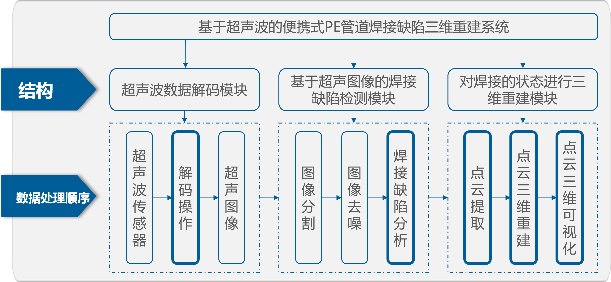

# 职业规划
- 因为我现在所掌握的知识与技能也都相当于打基础的阶段，并没有太偏向于某个明确的方向。可能对web后端服务器开发是有一定的基础，不过我自学的那个Linux项目偏重于学习性的，从中掌握一些Linux环境下的开发过程，以为包括网络通信相关的知识。所以我对于未来所从事的工作也没有太明确的想法，目前想的是以公司的安排为准，希望能够在某个确定的领域能够深入下去、并且做出一定的成绩。
# 对华为公司的看法
- 我本人对华为是相当认可的，在国内的科技公司里，华为是处于一个极其领先的地位，作为在校学生能真正接触到华为的产品大部分也是手机电脑之类的电子产品，对于华为研发的鸿蒙系统中的多屏协同功能在发布时我感到特别震撼，以及最近搭载win11系统的平板电脑等等，也让我觉得华为公司在电子产品的很多领域已经处于了世界领先的地位，也是因为近来年华为的科技的进步，导致了受到多方的阻碍。我了解到2012实验室就是能够突破国外对我们的一些技术封锁，所以我也是选择了咱们的2012实验室，在加上本科时有一定的嵌入式基础，所以选择投递了中央硬件研究院。而且我个人也认为要想突破技术封锁，硬件方面是尤为重要的。
# 课题
- 我的课题是基于超声波的便携式PE管道焊接缺陷三维重建系统
- 
# 自己的缺点
- 我感觉自己的缺点主要是沟通能力较差，从高中给同学讲题开始我也就意识到了自己这方面的不足，在前两次技术面和面试官讲自己代码题的思路时也感觉自己表达的不够清晰。
# 项目中遇到的困难
- 第二个项目是完全我来负责的，
# 实习中遇到的困难
- 因为今年情况特殊，上海这边只在暑期期间实习了两个月，也没有做很多事情，其中印象比较深刻的事是公司代码上存在的一个bug问题，当时我也是一起跟进了这个bug的修复工作，这个bug是由于其中一个项目的代码需要调用另一个项目代码生成的静态库，由于一些项目的版本升级导致的