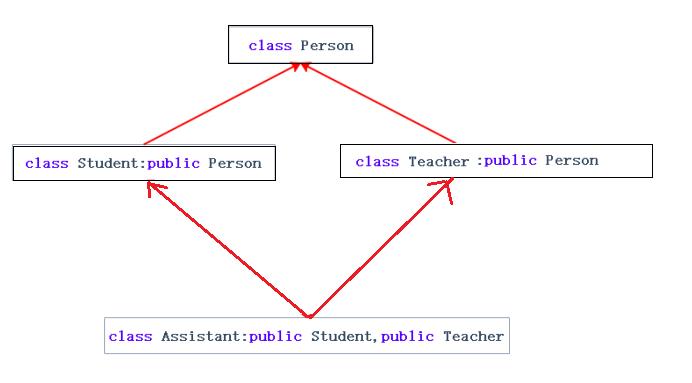
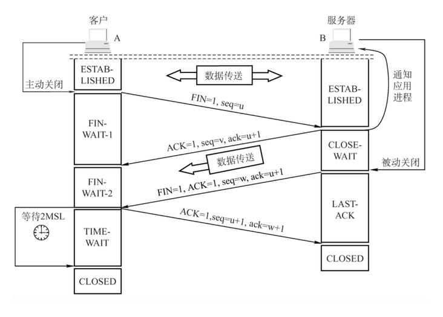

- [C++基础](#c基础)
  - [C语言和C++区别](#c语言和c区别)
  - [```struct```和```class```的区别](#struct和class的区别)
  - [```include```中```<>```和```""```的区别](#include中和的区别)
  - [```Int```和```Integer```的区别](#int和integer的区别)
  - [c++中的遍历```auto, auto&, const auto&```](#c中的遍历auto-auto-const-auto)
  - [导入C函数的关键字是什么，C++编译时和C有什么不同？](#导入c函数的关键字是什么c编译时和c有什么不同)
  - [C++强制类型转换](#c强制类型转换)
  - [程序从源码到执行文件，预编译、编译、汇编、链接](#程序从源码到执行文件预编译编译汇编链接)
  - [```extern```关键字](#extern关键字)
  - [```static```关键字](#static关键字)
  - [```volatile```关键字的作用，什么时候会用到](#volatile关键字的作用什么时候会用到)
  - [函数指针](#函数指针)
  - [静态变量初始化](#静态变量初始化)
  - [nullptr调用成员函数可以吗？为什么？](#nullptr调用成员函数可以吗为什么)
  - [野指针](#野指针)
  - [智能指针](#智能指针)
  - [静态局部变量，全局变量，局部变量的特点，以及使用场景](#静态局部变量全局变量局部变量的特点以及使用场景)
  - [C语言中结构体和联合体的区别](#c语言中结构体和联合体的区别)
  - [C++传值方式 值传递、引用传递、指针传递](#c传值方式-值传递引用传递指针传递)
  - [说说内联函数和宏函数的区别](#说说内联函数和宏函数的区别)
  - [运算符i++和++i的区别](#运算符i和i的区别)
  - [new和malloc的区别](#new和malloc的区别)
    - [malloc底层实现](#malloc底层实现)
    - [mmap()的原理和应用场景](#mmap的原理和应用场景)
    - [new底层实现](#new底层实现)
  - [const和define的区别](#const和define的区别)
  - [C++中函数指针和指针函数](#c中函数指针和指针函数)
  - [C++中常量指针和指针常量](#c中常量指针和指针常量)
  - [堆和栈的效率](#堆和栈的效率)
  - [堆和栈的区别](#堆和栈的区别)
  - [C++的内存管理](#c的内存管理)
    - [内存分配方式---栈、堆、代码区、全局/静态存储区、常量存储区](#内存分配方式---栈堆代码区全局静态存储区常量存储区)
    - [常见的内存错误及其对策](#常见的内存错误及其对策)
    - [内存泄漏](#内存泄漏)
    - [malloc和局部变量分配在堆还是栈？](#malloc和局部变量分配在堆还是栈)
    - [进程的内存片段](#进程的内存片段)
  - [什么是内存对齐](#什么是内存对齐)
  - [面向对象的三大特征 封装、继承、多态](#面向对象的三大特征-封装继承多态)
    - [多重继承-菱形继承](#多重继承-菱形继承)
    - [类继承时的访问权限](#类继承时的访问权限)
  - [面向过程和面向对象的区别](#面向过程和面向对象的区别)
  - [构造函数，默认构造函数、初始化构造函数、拷贝构造函数、移动构造函数。](#构造函数默认构造函数初始化构造函数拷贝构造函数移动构造函数)
  - [空类的默认生成函数](#空类的默认生成函数)
  - [拷贝构造函数和赋值运算符的区别](#拷贝构造函数和赋值运算符的区别)
  - [C++ 类对象的初始化顺序，有多重继承情况下的顺序](#c-类对象的初始化顺序有多重继承情况下的顺序)
  - [深拷贝和浅拷贝](#深拷贝和浅拷贝)
  - [C++多态](#c多态)
  - [重载和重写](#重载和重写)
    - [多态的底层实现：虚函数表](#多态的底层实现虚函数表)
  - [虚析构，为什么不能虚构造](#虚析构为什么不能虚构造)
  - [模板类是在什么时候实现的](#模板类是在什么时候实现的)
  - [深拷贝和浅拷贝](#深拷贝和浅拷贝-1)
  - [C++ 类内可以定义引用数据成员](#c-类内可以定义引用数据成员)
  - [什么是常函数，有什么作用](#什么是常函数有什么作用)
  - [数据结构](#数据结构)
    - [数组与链表的区别](#数组与链表的区别)
    - [数组与链表的优缺点](#数组与链表的优缺点)
  - [STL](#stl)
    - [vector](#vector)
    - [deque](#deque)
    - [list](#list)
    - [map、set、multimap、multiset](#mapsetmultimapmultiset)
    - [unordered_map、unordered_set、unordered_multimap、 unordered_multiset（hashtable）](#unordered_mapunordered_setunordered_multimap-unordered_multisethashtable)
  - [C++11的新特性](#c11的新特性)
    - [语法上](#语法上)
    - [标准库的扩充](#标准库的扩充)
- [操作系统](#操作系统)
  - [32位和64位系统](#32位和64位系统)
    - [64位处理器](#64位处理器)
  - [线程池](#线程池)
    - [线程池是什么](#线程池是什么)
    - [如何设计线程池](#如何设计线程池)
  - [软链接和硬链接的区别](#软链接和硬链接的区别)
  - [GDB](#gdb)
  - [大端小端，如何判断大端小端](#大端小端如何判断大端小端)
  - [进程调度算法](#进程调度算法)
  - [抢占式和非抢占式的区别](#抢占式和非抢占式的区别)
  - [操作系统如何申请以及管理内存 虚拟内存的优缺点](#操作系统如何申请以及管理内存-虚拟内存的优缺点)
  - [Linux内核态与用户态](#linux内核态与用户态)
  - [LRU算法及其实现方式](#lru算法及其实现方式)
  - [页表 虚拟内存->物理内存](#页表-虚拟内存-物理内存)
  - [堆栈溢出是什么，会怎么样？](#堆栈溢出是什么会怎么样)
  - [并发和并行](#并发和并行)
  - [进程、线程、协程是什么，区别是什么？](#进程线程协程是什么区别是什么)
    - [进程间切换](#进程间切换)
    - [进程间通信方式](#进程间通信方式)
    - [线程间通信方式](#线程间通信方式)
    - [进程同步方式](#进程同步方式)
    - [进程的状态 创建-就绪-运行-阻塞-终止](#进程的状态-创建-就绪-运行-阻塞-终止)
  - [孤儿进程，僵尸进程，守护进程](#孤儿进程僵尸进程守护进程)
  - [fork-创建子进程](#fork-创建子进程)
  - [互斥锁的机制，互斥锁与读写的区别](#互斥锁的机制互斥锁与读写的区别)
  - [死锁 产生条件 如何解决](#死锁-产生条件-如何解决)
- [单例和工厂设计模式](#单例和工厂设计模式)
- [计算机网络](#计算机网络)
  - [I/O多路复用](#io多路复用)
    - [select与poll](#select与poll)
    - [select与epoll的区别](#select与epoll的区别)
    - [epoll水平出发与边沿触发](#epoll水平出发与边沿触发)
  - [域名解析过程](#域名解析过程)
  - [TCP 三次握手和四次挥手的过程](#tcp-三次握手和四次挥手的过程)
  - [TCP 和 UDP 的区别](#tcp-和-udp-的区别)
    - [TCP 如何保证有序](#tcp-如何保证有序)
    - [TCP 超时重传](#tcp-超时重传)
    - [TCP 可靠性保证](#tcp-可靠性保证)
    - [滑动窗口](#滑动窗口)
    - [浏览器从输入 URL 到展现页面的全过程](#浏览器从输入-url-到展现页面的全过程)
  - [http协议报文的各部分内容](#http协议报文的各部分内容)
    - [HTTP 和 HTTPS 的区别](#http-和-https-的区别)
      - [HTTP 的方法](#http-的方法)
      - [HTTP 1.0，1.1，2.0 的主要区别](#http-101120-的主要区别)
      - [HTTP 常见的响应状态码及其含义](#http-常见的响应状态码及其含义)
      - [GET请求和 POST 请求的区别](#get请求和-post-请求的区别)
      - [Cookie 和 Session 的关系和区别](#cookie-和-session-的关系和区别)
      - [HTTPS 的加密与认证过程](#https-的加密与认证过程)
- [数据库](#数据库)
  - [MySQL设计三范式](#mysql设计三范式)
  - [常用sql语句](#常用sql语句)
  - [SQL中的三种删除方式区别](#sql中的三种删除方式区别)
  - [char和varchar的区别](#char和varchar的区别)
  - [jion，left join，right join](#jionleft-joinright-join)
  - [索引](#索引)
  - [回表查询](#回表查询)
  - [索引语法](#索引语法)
  - [MySQL索引结构](#mysql索引结构)
  - [索引失效的情况](#索引失效的情况)
  - [索引设计原则](#索引设计原则)
  - [事务的四大特性](#事务的四大特性)
  - [事务并发时存在的问题](#事务并发时存在的问题)
  - [事务的四个隔离级别](#事务的四个隔离级别)
  - [乐观锁与悲观锁](#乐观锁与悲观锁)
  - [读写锁](#读写锁)
  - [互斥锁](#互斥锁)
  - [互斥锁的机制，互斥锁与读写的区别](#互斥锁的机制互斥锁与读写的区别-1)
  - [死锁 产生条件 如何解决](#死锁-产生条件-如何解决-1)
  - [共享锁和排他锁](#共享锁和排他锁)
# C++基础
## C语言和C++区别
- 面向过程语言和面向对象语言
  - C语言是面向过程语言，即先分析出解决问题的步骤然后再将这些步骤一一实现
  - C++是面向对象语言，即把问题分成若干个对象，目的是为了描述某个事物在解决整个问题的步骤中的行为
- 关键字不同：C语言中有32个关键字，而C++有63个关键字。另外在C语言中struct关键字定义的变量不能有函数，而在C++中可以有函数
- 文件后缀名不同：C语言中源文件的后缀名是.c，C++源文件后缀名是.cpp
- 函数返回值不同：C语言中如果一个函数没有指定返回值类型，默认返回int类型；C++中如果一个函数没有返回值则必须指定为void
- 函数重载：函数重载是函数的一种特殊情况，指在同一作用域中，声明几个功能类似的同名函数，这些同名函数的形参列表（参数个数、类型、顺序）必须不同，返回值类型可以相同也可以不同，常用来处理实现功能类似数据类型不同的问题。C语言中由于函数符号的规则是根据名称产生的，因此它不具备函数重载，而C++生成的函数符号则考虑了函数名，参数以及参数类型等。所以C++可以根据函数名参数个数参数类型来判断重载，属于静态多态，必须同一作用域下才叫重载
- 参数列表：在C语言中函数没有指定参数列表时，默认可以接收任意多个参数；但在C++中，因为严格的参数类型检测，没有参数列表的函数，默认为 void，不接收任何参数
## ```struct```和```class```的区别
- struct 一般用于描述一个数据结构集合，而 class 是对一个对象数据的封装；
- struct 中默认的访问控制权限是 public 的，而 class 中默认的访问控制权限是 private 的。
- 在继承关系中，struct 默认是公有继承，而 class 是私有继承；
- class 关键字可以用于定义模板参数，就像 typename，而 struct 不能用于定义模板参数。
  
| |C|C++|
|:---:|:---:|:---:|
|成员函数|不能有|可以|
|静态成员|不能有|可以|
|访问控制|默认public，不能修改|public/private/protected|
|继承关系|不可以继承|可从类或其他结构体继承|
|初始化|不能直接初始化数据成员|可以|
|使用方式|需要加上struct关键字|可以省略|
## ```include```中```<>```和```""```的区别
- 尖括号```<>```的头文件是系统文件，双引号```""```的头文件是自定义文件
- 编译器预处理阶段查找头文件的路径不一样。
  - 使用尖括号```<>```的头文件的查找路径：编译器设置的头文件路径-->系统变量。
  - 使用双引号```""```的头文件的查找路径：当前头文件目录-->编译器设置的头文件路径-->系统变量。
## ```Int```和```Integer```的区别
- Integer是Int的包装类，Int是八种基本数据类型之一。
- Integer变量必须实例化以后才可以使用，而Int变量不需要实例化。
- Integer实际是对象的引用，当new一个Integer时，实际上是生成一个指针指向此对象，而Int是直接存储数据值。
- Integer的默认值是null，Int的默认值是0。
## c++中的遍历```auto, auto&, const auto&```
- ```for(auto x : range)```创建拷贝，无法修改range中的元素
- ```for(auto& x : range)```可以修改range中的元素，一般使用```for(auto&& x : range)```
- ```for(const auto & x : range)```只读range中的元素
## 导入C函数的关键字是什么，C++编译时和C有什么不同？
- ```extern "C" int strcmp(const char *s1, const char *s2); //指示这部分代码按C语言进行编译```
- 编译区别：由于C++支持函数重载，因此编译器编译函数的过程中会将函数的参数类型也加到编译后的代码中，而不仅仅是函数名；而C语言并不支持函数重载，因此编译C语言代码的函数时不会带上函数的参数类型，一般只包括函数名。
## C++强制类型转换
- ```static_cast```
  - 可以实现C++中内置基本数据类型之间的相互转换。如果涉及到类的话，```static_cast```只能在有相互联系的类型中进行相互转换，不一定包含虚函数。
  - 用于类层次结构中基类和派生类之间指针或引用的转换
        进行上行转换（把派生类的指针或引用转换成基类表示）是安全的
        进行下行转换（把基类的指针或引用转换为派生类表示），由于没有动态类型检查，所以是不安全的
  - 用于基本数据类型之间的转换，如把int转换成char。这种转换的安全也要开发人员来保证
  - 把空指针转换成目标类型的空指针
  - 把任何类型的表达式转换为void类型
- ```const_cast```
  - ```const```限定符通常被用来限定变量，用于表示该变量的值不能被修改。而```const_cast```则正是用于强制去掉这种不能被修改的常数特性，但需要特别注意的是```const_cast```不是用于去除变量的常量性，而是去除指向常数对象的指针或引用的常量性，其去除常量性的对象必须为指针或引用。
  - 常量指针被转化成非常量指针，并且仍然指向原来的对象；
  - 常量引用被转换成非常量引用，并且仍然指向原来的对象；
  - 常量对象被转换成非常量对象。
- ```reinterpret_cast```
  - 必须是一个指针、引用、算术类型、函数指针或者成员指针。它可以把一个指针转换成一个整数，也可以把一个整数转换成一个指针（先把一个指针转换成一个整数，在把该整数转换成原类型的指针，还可以得到原先的指针值）。
  - 改变指针或引用的类型；
  - 将指针或引用转换为一个足够长度的整形；
  - 将整型转换为指针或引用类型。
- ```dynamic_cast```
  - 其他三种都是编译时完成的，```dynamic_cast```是运行时处理的，运行时要进行类型检查。
  - 不能用于内置的基本数据类型的强制转换。
  - 转换成功返回指向类的指针或引用，转换失败则返回NULL
  - 基类中一定要有虚函数，否则编译不通过。
  - 在类的转换时，在类层次间进行上行转换时，```dynamic_cast```和```static_cast```的效果是一样的。在进行下行转换时，```dynamic_cast```具有类型检查的功能，比```static_cast```更安全。
## 程序从源码到执行文件，预编译、编译、汇编、链接
- 预编译
  - ```#define```宏定义替换
  - 处理条件预编译指令，```#if #ifdef```
  - 处理#include预编译指令，将被包含的文件插入到该预编译指令的位置。
  - 过滤所有的注释
  - 添加行号和文件名标识
- 编译
  - 词法分析 语法分析 语义分析
  - 代码优化 目标代码生成 目标代码优化
- 汇编
  - 将汇编代码转变成机器可以执行的指令
- 链接
  - 静态链接
    - 接的时候就已经把要调用的函数或者过程链接到了生成的可执行文件中
    - 删除静态库不影响程序执行。静态库:win:.lib文件，linux:.a文件
  - 动态链接
    - 执行的过程中，再去找要链接的函数，生成的可执行文件中没有函数代码
    - 删除动态库程序不可运行。动态库:win:.dll文件，linux:.so文件
## ```extern```关键字
- 修饰全局变量
  - 在声明全局变量的时候使用```extern```修饰变量，表明该变量定义于其他翻译单元。
- 修饰全局常量
  - 表明该全局常量拥有外部链接（可以被其他翻译单元发现），否则全局常量默认是只有内部链接，即不可被其他翻译单元发现。
- 修饰局部变量
  - 表明该局部变量在其他翻译单元中被定义，需要在链接的时候去解析。
- 修饰一个字符串
  - 形如```extern "C"``` 之类的用法大家肯定见过了，表明后接的代码块（或者后接的声明）使用C语言调用惯例。
- 修饰一个模板
  - 表明该模板已经在其他翻译单元实例化，不需要在这里实例化。
## ```static```关键字
- 定义全局静态变量和局部静态变量
  - 在变量前面加上static关键字。初始化的静态变量会在数据段分配内存，未初始化的静态变量会在BSS段分配内存。直到程序结束，静态变量始终会维持前值。只不过全局静态变量和局部静态变量的作用域不一样；
- 定义静态函数
  - 在函数返回类型前加上static关键字，函数即被定义为静态函数。静态函数只能在本源文件中使用；
- 在c++中，static关键字可以用于定义类中的静态成员变量
  - 使用静态数据成员，它既可以被当成全局变量那样去存储，但又被隐藏在类的内部。类中的static静态数据成员拥有一块单独的存储区，而不管创建了多少个该类的对象。所有这些对象的静态数据成员都共享这一块静态存储空间。
- 在c++中，static关键字可以用于定义类中的静态成员函数
  - 与静态成员变量类似，类里面同样可以定义静态成员函数。只需要在函数前加上关键字static即可。如静态成员函数也是类的一部分，而不是对象的一部分。所有这些对象的静态数据成员都共享这一块静态存储空间。
- 静态成员函数
  - **因为静态成员函数不属于任何一个对象，所以不具备this指针，也就无法对一个对象中的非静态成员进行访问。**
## ```volatile```关键字的作用，什么时候会用到
- ```volatile```可以防止变量被编译器优化，每次读取变量时都直接从变量地址中读取数据。如果这个变量是多任务共享的，或者一些状态判断的寄存器的值需要用```volatile```修饰。
## 函数指针
- 函数指针就是指向函数的指针变量。每一个函数都有一个入口地址，该入口地址就是函数指针所指向的地址。
- 应用场景：回调（callback）
  - 调用别人提供的 API函数，称为Call；
  - 如果别人的库里面调用我们的函数，就叫Callback；
  - 例如```sort()```函数自定义比较规则；
## 静态变量初始化
- C语言
  - 全局和静态变量，初始化发生在任何代码执行之前，属于编译期初始化。
- C++
  - 全局或静态对象当且仅当对象首次用到时才进行构造。
- 所在空间:都在静态存储区。
- 生命周期:静态全局变量、静态局部变量都在静态存储区，直到程序结束才会回收内存。类静态成员变量在静态存储区，当超出类作用域时回收内存
## nullptr调用成员函数可以吗？为什么？
- 可以
- 因为在编译时对象就绑定了函数地址，和指针空不空没关系。
- ptr为该类型的指针，在成员函数中的```this=ptr```,成员函数中使用到this，会导致运行出错。
## 野指针
- 指针指向的内存已经释放，指针未及时置空。此时指针的指向位置是不可知的，可能出现非法访问的错误。
- 避免方法
  - 初始化时置空->申请内存后判空->指针释放后置为nullptr
  - 使用智能指针
## 智能指针
- 智能指针对普通指针进行的一层封装。这样使得智能指针的行为动作像一个指针，本质上却是一个对象，这样可以方便管理一个对象的生命周期。在c++中，智能指针一共定义了4种：```auto_ptr```、```unique_ptr```、```shared_ptr```和```weak_ptr```。其中，```auto_ptr```在C++11已被摒弃，在C++17中已经移除不可用。
- 如果程序要使用多个指向同一个对象的指针，应选择```shared_ptr```。这样的情况包括
  - 有一个指针数组，并使用一些辅助指针来标示特定的元素，如最大的元素和最小的元素；
  - 两个对象包含都指向第三个对象的指针；
  - STL 容器包含指针。很多 STL 算法都支持复制和赋值操作，这些操作可用于```shared_ptr```，但不能用于 ```unique_ptr```（编译器发出 warning）和 ```auto_ptr```（行为不确定）。如果你的编译器没有提供 ```shared_ptr```，可使用```Boost```库提供的```shared_ptr```。
- 如果程序不需要多个指向同一个对象的指针，则可使用```unique_ptr```。如果函数使用```new```分配内存，并返还指向该内存的指针，将其返回类型声明为```unique_ptr```是不错的选择。这样，所有权转让给接受返回值的 ```unique_ptr```，而该智能指针将负责调用```delete```。
## 静态局部变量，全局变量，局部变量的特点，以及使用场景
- C++里作用域可分为6种：全局，局部，类，语句，命名空间和文件作用域。
  - 全局变量：全局作用域，可以通过extern作用于其他非定义的源文件。
  - 静态全局变量 ：全局作用域+文件作用域，所以无法在其他文件中使用。
  - 局部变量：局部作用域，比如函数的参数，函数内的局部变量等等。
  - 静态局部变量 ：局部作用域，只被初始化一次，直到程序结束。
- 所在空间：除了局部变量在栈上外，其他都在静态存储区。
- 生命周期： 局部变量在栈上，出了作用域就回收内存；而全局变量、静态全局变量、静态局部变量都在静态存储区，直到程序结束才会回收内存。
## C语言中结构体和联合体的区别
- 结构体
  - ```struct```是一个或多个变量的集合，这些变量可能为不同的类型，为了处理的方便而将这些变量组织在一个名字之下。由于结构体将一组相关变量看作一个单元而不是各自独立的实体，因此结构体有助于组织复杂的数据，特别是在大型的程序中。
- 联合体
  - ```union```是用于（在不同时刻）保存不同类型和长度的变量，它提供了一种方式，以在单块存储区中管理不同类型的数据。
- 区别：
  - ```struct```各成员各自拥有自己的内存，各自使用互不干涉，同时存在的，遵循内存对齐原则。一个```struct```变量的总长度等于所有成员的长度之和。
  - ```struct```各成员共用一块内存空间，并且同时只有一个成员可以得到这块内存的使用权(对该内存的读写)，各变量共用一个内存首地址。因而，联合体比结构体更节约内存。一个```union```变量的总长度至少能容纳最大的成员变量，而且要满足是所有成员变量类型大小的整数倍。
## C++传值方式 值传递、引用传递、指针传递
- 值传递
  - 形参即使在函数体内值发生变化，也不会影响实参的值；
- 引用传递
  - 形参在函数体内值发生变化，会影响实参的值；
- 指针传递
  - 在指针指向没有发生改变的前提下，形参在函数体内值发生变化，会影响实参的值；
## 说说内联函数和宏函数的区别
- 宏定义不是函数
- 宏函数在预编译时把宏名用宏体进行替换，没有类型检查，无论对错都直接替换。
- 内联函数则是在编译的时候进行代码插入，编译器会在每处调用内联函数的地方直接把内联函数的内容展开，这样可以省去函数的调用的开销，提高效率。在编译的时候会进行类型的检查。
- inline一般应用于比较小的频繁调用的函数，函数前使用```inline```关键字定义。
  - 如果函数体内的代码比较长，使用内联将导致内存消耗代价较高。
  - 如果函数体内出现循环，那么执行函数体内代码的时间要比函数调用的开销大。
## 运算符i++和++i的区别
- 赋值顺序不同：++ i 是先加后赋值；i ++ 是先赋值后加；++i和i++都是分两步完成的
- 效率不同：后置++执行速度比前置的慢
- i++ 不能作为左值，而++i 可以
- 两者都不是原子操作
## new和malloc的区别
- new是操作符，而malloc是函数。
- new在调用的时候先分配内存，再调用构造函数，释放的时候调用析构函数；而malloc没有构造函数和析构函数。
- malloc需要给定申请内存的大小，返回的指针需要强转；new会调用构造函数，不用指定内存的大小，返回指针不用强转。
- new可以被重载；malloc不行。
- new分配内存更直接和安全。
- new发生错误抛出异常，malloc返回null。
### malloc底层实现
- 当开辟的空间小于 128K 时，调用 brk（）函数；当开辟的空间大于 128K 时，调用mmap（）。malloc采用的是内存池的管理方式，以减少内存碎片。先申请大块内存作为堆区，然后将堆区分为多个内存块。
### mmap()的原理和应用场景
- mmap是一种内存映射文件的方法，将一个文件或者其它对象映射到进程的地址空间，实现文件磁盘地址和进程虚拟地址空间中一段虚拟地址的一一对映关系。实现这样的映射关系后，进程就可以采用指针的方式读写操作这一段内存，而系统会自动回写页面到对应的文件磁盘上。
- 使用场景
  - 对同一块区域频繁读写操作
  - 可用于实现用户空间和内核空间的高效交互
  - 可提供进程间共享内存及相互通信
  - 可实现高效的大规模数据传输
### new底层实现
- 创建一个新的对象
- 将构造函数的作用域赋值给这个新的对象（因此this指向了这个新的对象）
- 执行构造函数中的代码（为这个新对象添加属性）
- 返回新对象
## const和define的区别
- const生效于编译的阶段；define生效于预处理阶段。
- const定义的常量，在C语言中是存储在内存中、需要额外的内存空间的；define定义的常量，运行时是直接的操作数，并不会存放在内存中。
- const定义的常量是带类型的；define定义的常量不带类型。因此define定义的常量不利于类型检查。
## C++中函数指针和指针函数
- 指针函数本质是一个函数，其返回值为指针。 函数指针本质是一个指针，其指向一个函数。
- 写法不同
  ```C++
  int *fun(int x,int y); //指针函数
  int (*fun)(int x,int y); //函数指针
  ```
## C++中常量指针和指针常量
- 指针常量```int *const p```
  - 本质上一个常量，指针用来说明常量的类型，表示该常量是一个指针类型的常量。在指针常量中，指针自身的值是一个常量，不可改变，始终指向同一个地址。在定义的同时必须初始化。
- 常量指针```const int *p```
  - 本质上是一个指针，常量表示指针指向的内容，说明该指针指向一个“常量”。在常量指针中，指针指向的内容是不可改变的，指针看起来好像指向了一个常量。
## 堆和栈的效率
- 栈分配的软件优势：栈分配算法简单，所以高效；堆分配算法相对比较复杂。
- 栈分配的硬件优势：如果在栈上分配小块内存，因为```cache```和内存映射已经建立，则效率会非常高，远远优于堆分配；如果在栈上分配大块内存，在不考虑爆栈的情况下，其实两者效率差不到哪去。因为```cache```命中和内存映射总是在有限的大小进行的，其在栈中分配的大块内存照样```cache```不命中，而且映射未建立，所以这样的时间相差其实并不太多。
- 栈快的原因：栈有专门的寄存器，压栈和出栈的指令效率很高，而堆需要由OS动态调度，堆内存可能被OS调度在非物理内存中，或是申请内存不连续，造成碎片过多等问题；分配方式上，堆都是动态分配的，栈是编译器完成的。栈的分配和堆是不同的，他的动态分配是由编译器进行释放，无需我们手工实现
## 堆和栈的区别
- 堆栈空间分配不同。栈由操作系统自动分配释放 ，存放函数的参数值，局部变量的值等；堆一般由程序员分配释放。
- 堆栈缓存方式不同。栈使用的是一级缓存， 它们通常都是被调用时处于存储空间中，调用完毕立即释放；堆则是存放在二级缓存中，速度要慢些。
- 堆栈数据结构不同。堆类似数组结构；栈类似栈结构，先进后出。
- 堆内存是用来存放由new创建的对象和数组，即动态申请的内存都存放在堆内存；栈内存是用来存放在函数中定义的一些基本类型的变量和对象的引用变量
## C++的内存管理
- 在C++中，内存分成5个区，他们分别是堆、栈、自由存储区、全局/静态存储区和常量存储区。
### 内存分配方式---栈、堆、代码区、全局/静态存储区、常量存储区
- 栈，在执行函数时，函数内局部变量的存储单元都可以在栈上创建，函数执行结束时这些存储单元自动被释放。
- 堆，由程序员手动申请空间，在程序运行期间均有效。变量需要手动释放，否则只会在程序结束后被回收。
- 代码区，用来存储可执行代码的地方，只读不可写。
- 全局/静态存储区，全局变量和静态变量被分配到同一块内存中。
- 常量存储区，这是一块比较特殊的存储区，里面存放的是常量，不允许修改。
### 常见的内存错误及其对策
- 错误
  - 内存分配未成功，却使用了它。
  - 内存分配虽然成功，但是尚未初始化就引用它。
  - 内存分配成功并且已经初始化，但操作越过了内存的边界。
  - 忘记了释放内存，造成内存泄露。
  - 释放了内存却继续使用它。
- 对策
  - 定义指针时，先初始化为nullptr。
  - malloc或new申请内存之后，应该立即检查指针值是否为nullptr。防止使用指针值为nullptr的内存。
  - 不要忘记为数组和动态内存赋初值。防止将未被初始化的内存作为右值使用。
  - 避免数字或指针的下标越界，特别要当心发生“多1”或者“少1”操作。
  - 动态内存的申请与释放必须配对，防止内存泄漏。
  - 用free或delete释放了内存之后，立即将指针设置为NULL，防止“野指针”。
  - 使用智能指针。
### 内存泄漏
- 什么是内存泄漏
  - new和malloc申请资源使用后，没有用delete和free释放；
  - 子类继承父类时，父类析构函数不是虚函数。
  - Windows句柄资源使用后没有释放。
- 怎么检测？
  - 良好的编码习惯，使用了内存分配的函数，一旦使用完毕,要记得使用其相应的函数释放掉。
  - 将分配的内存的指针以链表的形式自行管理，使用完毕之后从链表中删除，程序结束时可检查改链表。
  - 使用智能指针。
  - 一些常见的工具插件，如ccmalloc、Dmalloc、Leaky、Valgrind等等。
### malloc和局部变量分配在堆还是栈？
- malloc是在堆上分配内存，需要程序员自己回收内存；局部变量是在栈中分配内存，超过作用域就自动回收。
### 进程的内存片段

- 从低地址到高地址，由代码段、数据段、BSS段、堆、共享区、栈等组成。
- 数据段：存放程序中已初始化的全局变量和静态变量的一块内存区域。
- 代码段：存放程序执行代码的一块内存区域。只读，代码段的头部还会包含一些只读的常数变量。
- BSS 段：存放程序中未初始化的全局变量和静态变量的一块内存区域。
- 运行时，多出堆区和栈区
  - 堆区：动态申请内存用。堆从低地址向高地址增长。
  - 栈区：存储局部变量、函数参数值。栈从高地址向低地址增长。是一块连续的空间。
- 最后还有一个共享区，位于堆和栈之间。
## 什么是内存对齐
- 应用于三种数据类型中：struct/class/union，内存对齐原则有四个
  - 数据成员对齐规则：结构(struct)或联合(union)的数据成员，第一个数据成员放在offset为0的地方，以后每个数据成员存储的起始位置要从该成员大小或者成员的子成员大小的整数倍开始。
  - 结构体作为成员:如果一个结构里有某些结构体成员,则结构体成员要从其内部"最宽基本类型成员"的整数倍地址开始存储。(struct a里存有struct b,b里有char,int ,double等元素,那b应该从8的整数倍开始存储)。
  - 收尾工作:结构体的总大小，也就是sizeof的结果，必须是其内部最大成员的"最宽基本类型成员"的整数倍。不足的要补齐。(基本类型不包括struct/class/uinon)。
  - sizeof(union)，以结构里面size最大元素为union的size，因为在某一时刻，union只有一个成员真正存储于该地址。
## 面向对象的三大特征 封装、继承、多态
- 封装：将数据和操作数据的方法进行有机结合，隐藏对象的属性和实现细节，仅对外公开接口来和对象进行交互。
- 继承：可以使用现有类的所有功能，并在无需重新编写原来的类的情况下对这些功能进行扩展。
- 多态：用父类型别的指针指向其子类的实例，然后通过父类的指针调用实际子类的成员函数。实现多态，有二种方式，重写，重载。
### 多重继承-菱形继承
- **多重继承**
  - 多重继承指一个子类有两个或两个以上的父类。```class A：public B,private C，protected D```
  - 多继承形式下的构造函数。```A(形参列表):B(形参列表),C(形参列表),D(形参列表){}```，构造函数的调用顺序与声明派生类继承基类出现的顺序相同；
  - 派生类对象中数据成员的排列形式：首先按照派生类定义形式中基类的声明顺序，将基类成员依次排列，接下来再存放派生类中新添加的数据
- **菱形继承**
  
  - 存在数据的二义性的问题，由于他们间接都有相同的基类导致的。还会有数据冗余浪费内存空间。
  - 使用虚继承解决此问题。引入虚基表。虚基表中存放的共同基类的偏移量，通过偏移量去查找基类。
  ```C++
  class A
  {
  public:
  	int m_a = 1;
  };
  class B :virtual public A
  {
  public:
  	int m_b = 2;
  };
  class C :virtual public A
  {
  public:
  	int m_c = 3;
  };
  class D :public B, public C
  {
  public:
  	int m_d = 4;
  };
  ```
### 类继承时的访问权限
|继承方式|派生类|派生类对象|
|:---:|:---:|:---:|
|public|基类的public、protected成员|基类的public成员|
|protected|基类的public、protected成员|基类的成员都不可访问|
|private|派生类可以访问基类的public、protected成员|基类的成员都不可访问|
## 面向过程和面向对象的区别
- 面向过程：根据业务逻辑从上到下写代码
- 面向对象：将数据与函数绑定到一起，进行封装，这样能够更快速的开发程序，减少了重复代码的重写过程
## 构造函数，默认构造函数、初始化构造函数、拷贝构造函数、移动构造函数。
- 默认构造函数和初始化构造函数。 在定义类的对象的时候，完成对象的初始化工作。有了有参的构造了，编译器就不提供默认的构造函数。
- 赋值构造函数默认实现的是值拷贝（浅拷贝）。
- 拷贝构造函数
  - 拷贝构造函数的参数必须使用引用传递
  - 如果拷贝构造函数中的参数不是一个引用，那么就相当于采用了传值的方式(pass-by-value)，传值的方式会调用该类的拷贝构造函数，从而造成无穷递归地调用拷贝构造函数。
- 移动构造函数。用于将其他类型的变量，隐式转换为本类对象。从A拷贝到B意味着，B分配了新内存，A的整个内容被拷贝到为B分配的新内存上。
## 空类的默认生成函数
- 无参的构造函数 在定义类的对象的时候，完成对象的初始化工作。
- 拷贝构造函数 拷贝构造函数用于复制本类的对象
- 赋值运算符 ```Empty& operator = (const Empty& copy)```
- 析构函数（非虚）
## 拷贝构造函数和赋值运算符的区别
- 拷贝构造函数生成新的类对象，赋值运算符不能；
- 拷贝构造函数是直接构造一个新的类对象，所以在初始化这个对象之前不用检测源对象是否与新建对象相同。赋值运算符需要检测，如果原来的对象中有内存分配要先把内存释放掉；
## C++ 类对象的初始化顺序，有多重继承情况下的顺序
- 创建派生类的对象，基类的构造函数优先被调用（也优先于派生类里的成员类）；
- 如果类里面有成员类，成员类的构造函数优先被调用；(也优先于该类本身的构造函数）
- 基类构造函数如果有多个基类，则构造函数的调用顺序是某类在类派生表中出现的顺序而不是它们在成员初始化表中的顺序；
- 成员类对象构造函数如果有多个成员类对象，则构造函数的调用顺序是对象在类中被声明的顺序而不是它们出现在成员初始化表中的顺序；
- 派生类构造函数，作为一般规则派生类构造函数应该不能直接向一个基类数据成员赋值而是把值传递给适当的基类构造函数,否则两个类的实现变成紧耦合的（tightly coupled）将更加难于正确地修改或扩展基类的实现。（基类设计者的责任是提供一组适当的基类构造函数）
- 父类构造函数–>成员类对象构造函数–>自身构造函数，其中成员变量的初始化与声明顺序有关，构造函数的调用顺序是类派生列表中的顺序，析构顺序和构造顺序相反。
## 深拷贝和浅拷贝
- 浅拷贝：又称值拷贝，将源对象的值拷贝到目标对象中去，本质上来说源对象和目标对象共用一份实体，只是所引用的变量名不同，地址其实还是相同的。
- 深拷贝：拷贝的时候先开辟出和源对象大小一样的空间，然后将源对象里的内容拷贝到目标对象中去，这样两个指针就指向了不同的内存位置。
- 深拷贝的实现：深拷贝的拷贝构造函数和赋值运算符的重载传统实现
## C++多态
- 多态：用父类型别的指针指向其子类的实例，然后通过父类的指针调用实际子类的成员函数。实现多态，有二种方式，重写，重载。
## 重载和重写
- 重写：是指派生类中存在重新定义的函数。其函数名，参数列表，返回值类型，所有都必须同基类中被重写的函数一致。只有函数体不同（花括号内），派生类对象调用时会调用派生类的重写函数，不会调用被重写函数。重写的基类中被重写的函数必须有virtual修饰。
- 重载：是指同一可访问区内被声明的几个具有不同参数列（参数的类型，个数，顺序不同）的同名函数，根据参数列表确定调用哪个函数，重载不关心函数返回类型。
- 区别：
  - 定义不同---重载是定义相同的方法名，参数不同；重写是子类重写父类的方法。
  - 范围不同---重载是在一个类中，重写是子类与父类之间的。
  - 多态不同---重载是编译时的多态性，重写是运行时的多态性。
  - 返回不同---重载对返回类型没有要求，而重写要求返回类型，有兼容的返回类型。
  - 参数不同---重载的参数个数、参数类型、参数顺序可以不同，而重写父子方法参数必须相同。
  - 修饰不同---重载对访问修饰没有特殊要求，重写访问修饰符的限制一定要大于被重写方法的访问修饰符。
- 静态多态：编译器在编译期间完成的，编译器会根据实参类型来推断该调用哪个函数，如果有对应的函数，就调用，没有则在编译时报错。通过函数重载来实现。
- 动态多态：其实要实现动态多态，需要几个条件——即动态绑定条件
  - 虚函数。基类中必须有虚函数，在派生类中必须重写虚函数。
  - 通过基类类型的指针或引用来调用虚函数。
### 多态的底层实现：虚函数表
- 当基类中存在虚函数时，基类的对象中会多出一部分内存（4字节）用来存储虚函数表的地址。
- 虚函数表：线性表，本质为动态数组。存放函数指针分别指向本类中虚函数地址。
- 派生类继承时，本身也会有虚函数表，表中元素会继承基类虚函数表的元素。
- 派生类未重写基类中的虚函数：派生类中虚函数表中的函数指针指向基类中的虚函数地址。
- 派生类重写基类中的虚函数：派生类中虚函数表中的函数指针指向本类中的对应虚函数地址。
####虚函数与纯虚函数（抽象类）
- 纯虚函数：不需要对函数进行实现。存在纯虚函数时,其虚函数表不完全，有个空位。
- 虚函数：需要对函数进行实现
- 引入纯虚函数原因
  - 很多情况下基类本身生成对象是不合理的，例如，动物作为一个基类可以派生出老虎、孔雀等子类，但动物本身生成对象明显不合常理。
  - 如果派生类需要实例化对象，必须重新声明基类中的纯虚函数，并且实现。
- 抽象类
  - 带有纯虚函数的类为抽象类。
  - 抽象类的主要作用是将有关的操作作为结果接口组织在一个继承层次结构中，由它来为派生类提供一个公共的根，派生类将具体实现在其基类中作为接口的操作。
  - 抽象类只能作为基类来使用，其纯虚函数的实现由派生类给出。如果派生类中没有重新定义纯虚函数，而只是继承基类的纯虚函数，则这个派生类仍然还是一个抽象类。
  - 抽象类是不能定义对象的。
## 虚析构，为什么不能虚构造
- 虚析构：将可能会被继承的父类的析构函数设置为虚函数，可以保证当我们new一个子类，然后使用基类指针指向该子类对象，释放基类指针时可以释放掉子类的空间，防止内存泄漏。如果基类的析构函数不是虚函数，在特定情况下会导致派生来无法被析构。
  - 用派生类类型指针绑定派生类实例，析构的时候，不管基类析构函数是不是虚函数，都会正常析构
  - 用基类类型指针绑定派生类实例，析构的时候，如果基类析构函数不是虚函数，则只会析构基类，不会析构派生类对象，从而造成内存泄漏。为什么会出现这种现象呢，个人认为析构的时候如果没有虚函数的动态绑定功能，就只根据指针的类型来进行的，而不是根据指针绑定的对象来进行，所以只是调用了基类的析构函数；如果基类的析构函数是虚函数，则析构的时候就要根据指针绑定的对象来调用对应的析构函数了。
- 不能虚构造的原因
  - 从存储空间角度：虚函数对应一个虚函数表,这个表的地址是存储在对象的内存空间的。如果将构造函数设置为虚函数，就需要到虚函数表中调用，可是对象还没有实例化，没有内存空间分配，如何调用。
  - 从使用角度：虚函数主要用于在信息不全的情况下，能使重载的函数得到对应的调用。构造函数本身就是要初始化实例，那使用虚函数也没有实际意义呀。所以构造函数没有必要是虚函数。虚函数的作用在于通过父类的指针或者引用来调用它的时候能够变成调用子类的那个成员函数。而构造函数是在创建对象时自动调用的，不可能通过父类的指针或者引用去调用，因此也就规定构造函数不能是虚函数。
  - 从实现上看，vbtl 在构造函数调用后才建立，因而构造函数不可能成为虚函数。从实际含义上看，在调用构造函数时还不能确定对象的真实类型（因为子类会调父类的构造函数）；而且构造函数的作用是提供初始化，在对象生命期只执行一次，不是对象的动态行为，也没有太大的必要成为虚函数。
## 模板类是在什么时候实现的
- 模板实例化：模板的实例化分为显示实例化和隐式实例化，前者是研发人员明确的告诉模板应该使用什么样的类型去生成具体的类或函数，后者是在编译的过程中由编译器来决定使用什么类型来实例化一个模板不管是显示实例化或隐式实例化，最终生成的类或函数完全是按照模板的定义来实现的
- 模板具体化：当模板使用某种类型类型实例化后生成的类或函数不能满足需要时，可以考虑对模板进行具体化。具体化时可以修改原模板的定义，当使用该类型时，按照具体化后的定义实现，具体化相当于对某种类型进行特殊处理
## 深拷贝和浅拷贝
- 浅拷贝：又称值拷贝，将源对象的值拷贝到目标对象中去，本质上来说源对象和目标对象共用一份实体，只是所引用的变量名不同，地址其实还是相同的。
- 深拷贝：拷贝的时候先开辟出和源对象大小一样的空间，然后将源对象里的内容拷贝到目标对象中去，这样两个指针就指向了不同的内存位置。
- 深拷贝的实现：深拷贝的拷贝构造函数和赋值运算符的重载传统实现；
## C++ 类内可以定义引用数据成员
- 遵循以下三个规则：
  - 不能用默认构造函数初始化，必须提供构造函数来初始化引用成员变量。否则会造成引用未初始化错误。
  - 构造函数的形参也必须是引用类型。
  - 不能在构造函数里初始化，必须在初始化列表中进行初始化。
## 什么是常函数，有什么作用
- 类的成员函数后面加 const，表明这个函数不会对这个类对象的数据成员（准确地说是非静态数据成员）作任何改变。
## 数据结构
  ### 数组与链表的区别
  - 逻辑结构：
    - 数组在内存中连续；链表采用动态内存分配的方式，在内存中不连续；
    - 数组在使用前事先固定长度，不能改变数组长度；链表支持动态增删元素；
    - 数组元素减少时会造成内存浪费；链表可以使用malloc或new来申请内存，不用时使用free或delete来释放内存;
    - 数组利用下标定位，查找的时间复杂度是O(1)，链表通过遍历定位元素，查找的时间复杂度是O(N);
    - 数组插入和删除需要移动其他元素，时间复杂度是O(N)，链表的插入或删除不需要移动其他元素，时间复杂度是O(1)
  - 内存结构：数组从栈上分配内存，使用方便但自由度小；链表在堆上分配内存，自由度大但要注意造成内存泄漏；
  - 访问效率：数组在内存中顺序存储，通过下标访问，访问效率高；链表需要从头遍历访问，访问效率低；
  - 越界问题：数组大小固定，存在访问越界的风险；链表只要能申请空间就无越界风险
  ### 数组与链表的优缺点
  - 数组
    - 优点：
      - 随机访问性比较强，可以通过下标进行快速定位；
      - 查找速度快
    - 缺点：
      - 插入和删除的效率低，需要移动其他元素；
      - 会造成内存的浪费，因为内存是连续的，所以在申请数组的时候就必须规定其内存的大小，如果不合适，就会造成内存的浪费；
      - 内存空间要求高，创建一个数组，必须要有足够的连续内存空间；数组的大小是固定的，在创建数组的时候就已经规定好，不能动态拓展
    - 链表
    - 优点：
    - 插入和删除的效率高，只需要改变指针的指向就可以进行插入和删除；
    - 内存利用率高，不会浪费内存，可以使用内存中细小的不连续的空间，只有在需要的时候才去创建空间。大小不固定，拓展很灵活
    - 缺点：查找的效率低，因为链表是从第一个节点向后遍历查找
## STL
  - 由6部分组成：容器(Container)、算法（Algorithm）、 迭代器（Iterator）、仿函数（Function object）、适配器（Adaptor）、空间配制器（Allocator）。
  - 容器：一些封装数据结构的模板类。
  - 算法：例如```sort()```排序函数。
  - 迭代器
    - 在 C++ STL 中，对容器中数据的读和写，是通过迭代器完成的，容器和算法可以通过迭代器无缝连接。
    - 迭代器失效：
      - 对于序列容器vector，deque来说，使用erase后，后边的每个元素的迭代器都会失效，后边每个元素都往前移动一位，erase返回下一个有效的迭代器。
      - 对于关联容器map，set来说，使用了erase后，当前元素的迭代器失效，但是其结构是红黑树，删除当前元素，不会影响下一个元素的迭代器，所以在调用erase之前，记录下一个元素的迭代器即可。
      - 对于list来说，它使用了不连续分配的内存，并且它的erase方法也会返回下一个有效的迭代器，因此上面两种方法都可以使用。
  - 仿函数：需要自定义一些比较规则时使用。
  - 适配器：专门用来修改现有类的接口，提供一中新的接口；或调用现有的函数来实现所需要的功能。主要包括3中适配器Container Adaptor、Iterator Adaptor、Function Adaptor。
  - 空间配制器： 为STL提供空间配置的系统。其中主要工作包括两部分：
    - 对象的创建与销毁；
    - 内存的获取与释放。
  ### vector
  - 动态数组。元素在内存连续存放。随机存取任何元素都能在常数时间完成。在尾端增删元素具有较佳的性能。
  - 时间复杂度：插入: O(N) 查看: O(1) 删除: O(N)
  ### deque
  - 双向队列。元素在内存连续存放。随机存取任何元素都能在常数时间完成（仅次于vector）。在两端增删元素具有较佳的性能（大部分情况下是常数时间）。
  - 时间复杂度：插入: O(N) 查看: O(1) 删除: O(N)
  ### list
  - 双向链表。元素在内存不连续存放。在任何位置增删元素都能在常数时间完成。不支持随机存取。
  - 时间复杂度：插入: O(N) 查看: O(1) 删除: O(1)
  ### map、set、multimap、multiset
  - 内部实现了一个红黑树，红黑树有自动排序的功能，因此map内部所有元素都是有序的，红黑树的每一个节点都代表着map的一个元素。
  - 红黑树：特点就是左子树上所有节点的键值都小于根节点的键值，右子树所有节点的键值都大于根节点的键值。使用中序遍历可将键值按照从小到大遍历出来。
  - 时间复杂度：插入: O(logN) 查看: O(logN) 删除: O(logN)
  ### unordered_map、unordered_set、unordered_multimap、 unordered_multiset（hashtable）
  - hashtable采用了函数映射的思想记录的存储位置与记录的关键字关联起来，从而能够很快速地进行查找。
  - 插入: O(1)，最坏情况O(N)
  - 查看: O(1)，最坏情况O(N)
  - 删除: O(1)，最坏情况O(N)
## C++11的新特性
### 语法上
- 统一的初始化方法,使用```{}```
- 成员变量默认初始化，类成员变量可以在定义时就初始化。
- auto关键字 用于定义变量，编译器可以自动判断的类型（前提：定义一个变量时对其进行初始化）
- decltype 求表达式的类型
- 智能指针 shared_ptr
- 空指针 nullptr（原来NULL）
- 基于范围的for循环
- 右值引用和move语义
### 标准库的扩充
- 新增unordered_map
- 正则表达式 ```<regex>```
- Lambda表达式
# 操作系统
## 32位和64位系统
- 区别
  - 64bit CPU拥有更大的寻址能力，最大支持到16GB内存，而32bit只支持4G内存
  - 64位CPU一次可提取64位数据，比32位提高了一倍，理论上性能会提升1倍。但这是建立在64bit操作系统，64bit软件的基础上的。
### 64位处理器
- 优点
  - 硬件：更快的执行速度，更大的内存管理
  - 软件：最新的尖端软件首先出现在64位平台
- 缺点
  - 硬件：缺乏驱动程序，很多现有硬件无法使用
  - 软件：操作系统不是问题，但是软件出现不兼容难题
## 线程池
### 线程池是什么
- 线程池就是相当于提前申请了一些资源也就是线程，需要的时候就从线程池中取出线程来处理一些事情，处理完毕之后再把线程放回去。
### 如何设计线程池
- 我们需要存放我们创建好的线程，因此我们需要一个容器专门放线程
- 需要一个容器来存放我们的任务，每次把任务放到这个容器里面
- 由于是多线程的读取任务，所以必不可少的我们需要锁，每次读取任务需要加锁和解锁
- 我们需要判断什么时候终止，因此还需要一个判断终止的变量
- 为了避免轮询的判断任务集装箱里面是不是空的，这样效率太低了，因此我们这里采用条件变量（条件变量是并发编程中的一种同步机制，条件变量使得线程能够阻塞到等待某个条件发生后，再继续执行，期间还会把之前拿到的锁先释放掉，不影响其它人拿这把锁。因此条件变量十分强大而高效。）
## 软链接和硬链接的区别
- 定义不同
  - 软链接又叫符号链接，这个文件包含了另一个文件的路径名。可以是任意文件或目录，可以链接不同文件系统的文件。
  - 硬链接就是一个文件的一个或多个文件名。把文件名和计算机文件系统使用的节点号链接起来。因此我们可以用多个文件名与同一个文件进行链接，这些文件名可以在同一目录或不同目录。
- 限制不同
  - 硬链接只能对已存在的文件进行创建，不能交叉文件系统进行硬链接的创建；
  - 软链接可对不存在的文件或目录创建软链接；可交叉文件系统；
- 创建方式不同
  - 硬链接不能对目录进行创建，只可对文件创建；
  - 软链接可对文件或目录创建；
- 影响不同
  - 删除一个硬链接文件并不影响其他有相同 inode 号的文件。
  - 删除软链接并不影响被指向的文件，但若被指向的原文件被删除，则相关软连接被称为死链接（即 dangling link，若被指向路径文件被重新创建，死链接可恢复为正常的软链接）。
## GDB
|命令|作用|
|:---:|:---:|
|quit|退出gdb，结束调试|
|list|查看程序源代码|
|run|程序开始执行|
|break|设置断点|
|watch 条件表达式|条件表达式发生改变时程序就会停下来|
|next|继续执行下一条语句 ，不进入函数内部|
|step|继续执行下一条语句，进入函数内部|
|set follow-fork-mode child/parent|调试子进程/父进程|
## 大端小端，如何判断大端小端
- 小端模式：低的有效字节存储在低的存储器地址。小端一般为主机字节序；常用的X86结构是小端模式。很多的ARM，DSP都为小端模式。
- 大端模式：高的有效字节存储在低的存储器地址。大端为网络字节序；KEIL C51则为大端模式。
- 根据联合体来判断系统是大端还是小端。因为联合体变量总是从低地址存储。
  ```C++
  int fun1(){  
    union test{   
        char c;   
        int i; 
    };  
    test t; t.i = 1;  
    //如果是大端，则t.c为0x00，则t.c != 1，反之是小端  
    return (t.c == 1);  
  }  
  ```
## 进程调度算法
- 先来先服务调度算法
  - 每次调度都是从后备作业（进程）队列中选择一个或多个最先进入该队列的作业（进程），将它们调入内存，为它们分配资源、创建进程，然后放入就绪队列。
- 短作业(进程)优先调度算法
  - 短作业优先(SJF)的调度算法是从后备队列中选择一个或若干个估计运行时间最短的作业（进程），将它们调入内存运行。
- 高优先级优先调度算法
  - 当把该算法用于作业调度时，系统将从后备队列中选择若干个优先权最高的作业装入内存。当用于进程调度时，该算法是把处理机分配给就绪队列中优先权最高的进程
- 时间片轮转法
  - 每次调度时，把CPU 分配给队首进程，并令其执行一个时间片。时间片的大小从几ms 到几百ms。当执行的时间片用完时，由一个计时器发出时钟中断请求，调度程序便据此信号来停止该进程的执行，并将它送往就绪队列的末尾；然后，再把处理机分配给就绪队列中新的队首进程，同时也让它执行一个时间片。
- 多级反馈队列调度算法
  - 综合前面多种调度算法。
## 抢占式和非抢占式的区别
- 非抢占式优先权算法,系统一旦把处理机分配给就绪队列中优先权最高的进程后，该进程便一直执行下去，直至完成；或因发生某事件使该进程放弃处理机时，系统方可再将处理机重新分配给另一优先权最高的进程。
- 抢占式优先权调度算法,系统同样是把处理机分配给优先权最高的进程，使之执行。但在其执行期间，只要又出现了另一个其优先权更高的进程，进程调度程序就立即停止当前进程(原优先权最高的进程)的执行，重新将处理机分配给新到的优先权最高的进程。
## 操作系统如何申请以及管理内存 虚拟内存的优缺点
- 物理内存
  - 物理内存有四个层次，按访问时间从快到慢排序分别是寄存器、高速缓存、主存、磁盘。
  - 内存管理器
    - 主要工作是有效的管理内存，记录哪些内存是正在使用的，在进程需要时分配内存以及在进程完成时回收内存。
- 什么是虚拟内存
  - 操作系统为每一个进程分配一个独立的地址空间，但是虚拟内存。虚拟内存与物理内存存在映射关系，通过页表寻址完成虚拟地址和物理地址的转换。
- 虚拟内存的优点
  - 扩大地址空间。每个进程独占一个4G空间，虽然真实物理内存没那么多。
  - 内存保护：防止不同进程对物理内存的争夺和践踏，可以对特定内存地址提供写保护，防止恶意篡改。
  - 可以实现内存共享，方便进程通信。
  - 可以避免内存碎片，虽然物理内存可能不连续，但映射到虚拟内存上可以连续。
- 虚拟内存的缺点
  - 虚拟内存需要额外构建数据结构，占用空间。
  - 虚拟地址到物理地址的转换，增加了执行时间。
  - 页面换入换出耗时。
  - 一页如果只有一部分数据，浪费内存。
- 申请内存 （使用系统调用）
  - brk
  - mmap
## Linux内核态与用户态
- 内核态（系统态）与用户态是操作系统的两种运行级别。内核态拥有最高权限，可以访问所有系统指令；用户态则只能访问一部分指令。
- 什么时候进入内核态：共有三种方式：a、系统调用。b、异常。c、设备中断。其中，系统调用是主动的，另外两种是被动的。
- 区别：
  - 内核态运行操作系统程序，操作硬件，用户态运行用户程序；当程序运行在3级特权级上时，可以称之为运行在用户态，当程序运行在0级特权级上时，称之为运行在内核态。处于用户态执行时，进程所能访问的内存空间和对象受到限制，其所处于占有的处理器是可被抢占的处于内核态执行时，则能访问所有的内存空间和对象，且所占有的处理器是不允许被抢占的。
## LRU算法及其实现方式
- LRU算法：LRU算法用于缓存淘汰。思路是将缓存中最近最少使用的对象删除掉
- 实现方式：利用链表和hashmap。
  - 当需要插入新的数据项的时候，如果新数据项在链表中存在（一般称为命中），则把该节点移到链表头部，如果不存在，则新建一个节点，放到链表头部，若缓存满了，则把链表最后一个节点删除即可。
  - 在访问数据的时候，如果数据项在链表中存在，则把该节点移到链表头部，否则返回-1。这样一来在链表尾部的节点就是最近最久未访问的数据项。
## 页表 虚拟内存->物理内存
- 页表是虚拟内存的概念。操作系统虚拟内存到物理内存的映射表，就被称为页表。
- 在系统启动时，操作系统将整个物理内存以 4K 为单位，划分为各个页。进行内存分配时都以页为单位，4G物理内存，只需要8M的映射表即可，一些进程没有使用到的虚拟内存，也并不需要保存映射关系，Linux为大内存设计了多级页表，可以进一步减少了内存消耗。
## 堆栈溢出是什么，会怎么样？
- 堆溢出：比如不断的new 一个对象，一直创建新的对象，而不进行释放，最终导致内存不足。将会报错：OutOfMemory Error。
- 栈溢出：一次函数调用中，栈中将被依次压入：参数，返回地址等，而方法如果递归比较深或进去死循环，就会导致栈溢出。将会报错：StackOverflow Error。
## 并发和并行
- 并发：对于单个CPU，在一个时刻只有一个进程在运行，但是线程的切换时间则减少到纳秒数量级，多个任务不停来回快速切换。
- 并行：对于多个CPU，多个进程同时运行。
## 进程、线程、协程是什么，区别是什么？
- 进程：程序是指令、数据及其组织形式的描述，而进程则是程序的运行实例，包括程序计数器、寄存器和变量的当前值。
- 线程：微进程，一个进程里更小粒度的执行单元。一个进程里包含多个线程并发执行任务。
- 协程：协程是微线程，在子程序内部执行，可在子程序内部中断，转而执行别的子程序，在适当的时候再返回来接着执行。
- 区别
  - 一个线程从属于一个进程；一个进程可以包含多个线程。
  - 一个线程挂掉，对应的进程挂掉；一个进程挂掉，不会影响其他进程。
  - 进程是系统资源调度的最小单位；线程CPU调度的最小单位。
  - 进程系统开销显著大于线程开销；线程需要的系统资源更少。
  - 进程在执行时拥有独立的内存单元，多个线程共享进程的内存，如代码段、数据段、扩展段；但每个线程拥有自己的栈段和寄存器组。
  - 进程切换时需要刷新TLB并获取新的地址空间，然后切换硬件上下文和内核栈，线程切换时只需要切换硬件上下文和内核栈。
  - 通信方式不一样
  - 进程适应于多核、多机分布；线程适用于多核
### 进程间切换
- 保护被中断进程的处理器现场信息
- 修改被中断进程的进程控制块有关信息，如进程状态等
- 把被中断进程的进程控制块加入有关队列
- 选择下一个占有处理器运行的进程
- 根据被选中进程恢复处理器现场
### 进程间通信方式
- 同个主机之间
  - 管道：有名管道、匿名管道，匿名管道只可应用于有关系的进程之间，例如父子进程。半双工管道。本质为一个文件，通过文件描述符0，1来操作读、写端。
  - 消息量：：是一个计数器，可以用来控制多个进程对共享资源的访问。信号量用于实现进程间的互斥与同步。
  - 信号：通知接收进行的某个时间发生，比如子进程结束后发出SIGCHLD信号。
  - 内存共享：多个进程共享同一款内存空间。
- 不同主机间
  - socket套接字：用于不同主机之间的通信。
  - 消息队列。
### 线程间通信方式
- 临界区：每个线程中访问临界资源的那段代码称为临界区，每次只准许一个线程进入临界区，进入后不允许其他线程进入。
- 互斥量：采用互斥对象机制，只有拥有互斥对象的线程才可以访问。因为互斥对象只有一个，所以可以保证公共资源不会被多个线程同时访问。
- 信号量：计数器，允许多个线程同时访问同一个资源。
- 条件变量：通过条件变量通知操作的方式来保持多线程同步。
- 读写锁：读写锁与互斥量类似。但互斥量要么是锁住状态，要么就是不加锁状态。读写锁一次只允许一个线程写，但允许一次多个线程读，这样效率就比互斥锁要高。
### 进程同步方式
- 信号量：信号量用于实现进程间的互斥与同步。P操作(递减操作)可以用于阻塞一个进程，V操作(增加操作)可以用于解除阻塞一个进程。
- 消息队列：消息的链接表，放在内核中。消息队列独立于发送与接收进程，进程终止时，消息队列及其内容并不会被删除；消息队列可以实现消息的随机查询，可以按照消息的类型读取。
### 进程的状态 创建-就绪-运行-阻塞-终止
- 创建态：需要获取资源创建进程管理块
- 就绪态：未获得处理器资源，无法运行。
- 运行态：获得处理器资源，在时间片结束后，进入就绪态。
- 阻塞态：在运行期间，其运行所需的其他资源无法获得，进入阻塞态。
- 终止态：进程结束，进入终止态。
## 孤儿进程，僵尸进程，守护进程
- 孤儿进程：是指一个父进程退出后，而它的一个或多个子进程还在运行，那么这些子进程将成为孤儿进程。孤儿进程将被init进程（进程号为1）所收养，并且由init进程对它们完整状态收集工作。
- 僵尸进程：是指一个进程使用fork函数创建子进程，如果子进程退出，而父进程并没有调用wait()或者waitpid()系统调用取得子进程的终止状态，那么子进程的进程描述符仍然保存在系统中，占用系统资源，这种进程称为僵尸进程。
- 如何解决僵尸进程：1、在fork子进程之后我们都要及时使用wait系统调用,当子进程退出的时候，内核都会给父进程一个SIGCHLD信号，所以我们可以建立一个捕获SIGCHLD信号的信号处理函数，在函数体中调用wait。2、使用kill命令。
- 守护进程：守护进程是运行在后台的一种生存期长的特殊进程。它独立于控制终端，处理一些系统级别任务。
- 守护进程实现：使用fork创建子进程并退出父进程，子进程调用setsid()开启新的会话。
## fork-创建子进程
- fork()函数创建一个新进程后，会为这个新进程分配进程空间，将父进程的进程空间中的内容复制到子进程的进程空间中，包括父进程的数据段和堆栈段，并且和父进程共享代码段。这时候，子进程和父进程一模一样，都接受系统的调度。因为两个进程都停留在fork()函数中，最后fork()函数会返回两次，一次在父进程中返回，一次在子进程中返回。
- 对于父进程，fork()函数返回新创建的子进程的PID，对于子进程，fork()函数调用成功会返回0。创建出错，fork()函数返回-1。
## 互斥锁的机制，互斥锁与读写的区别
- 互斥锁机制：mutex，用于保证在任何时刻，都只能有一个线程访问该对象。当获取锁操作失败时，线程会进入睡眠，等待锁释放时被唤醒。
- 互斥锁和读写锁：
  - 读写锁区分读者和写者，而互斥锁不区分
  - 互斥锁同一时间只允许一个线程访问该对象，无论读写；读写锁同一时间内只允许一个写者，但是允许多个读者同时读对象。
## 死锁 产生条件 如何解决
- 死锁：是指多个进程在执行过程中，因争夺资源而造成了互相等待。
- 产生条件
  - 互斥条件：访问临界资源时，进行对分配的资源不允许其他进程访问。
  - 请求保持条件：进程获得资源后，又对其他资源发出请求。
  - 不可剥夺条件：进程已获得的资源，只能自己释放。
  - 环路等待条件：若干进程之间形成一种头尾相连的循环等待资源关系。
- 解决方法
  - 资源一次性分配：只有进程获取到所有所需资源时进入运行态。
  - 资源可剥夺
  - 资源有序分配
# 单例和工厂设计模式
- [CSDN](https://blog.csdn.net/qq_42200163/article/details/114216449)
# 计算机网络
## I/O多路复用
- select，poll，epoll都是IO多路复用的机制，I/O多路复用就是通过一种机制，可以监视多个文件描述符，一旦某个文件描述符就绪（一般是读就绪或者写就绪），能够通知应用程序进行相应的读写操作。
### select与poll
- 会监听socket绑定的所有文件描述符，当有数据需要读取时，会将对应的文件描述符置位，会返回文件描述符置位的个数，需要自己遍历来确定具体操作哪个文件描述符来读取数据。是阻塞函数。每次调用select，都需要把fd集合从用户态拷贝到内核态，这个开销在fd很多时会很大；
### select与epoll的区别
- 每次调用select，都需要把fd集合从用户态拷贝到内核态，这个开销在fd很多时会很大；而epoll保证了每个fd在整个过程中只会拷贝一次。
- 每次调用select都需要在内核遍历传递进来的所有fd；而epoll只需要轮询一次fd集合，同时查看就绪链表中有没有就绪的fd就可以了。
- select支持的文件描述符数量太小了，默认是1024；而epoll没有这个限制，它所支持的fd上限是最大可以打开文件的数目，这个数字一般远大于2048。
### epoll水平出发与边沿触发
- 水平触发下，只要这个fd还有数据可读，每次 epoll_wait都会返回它的事件，提醒用户程序去操作；
- 边缘触发下，它只会提示一次，直到下次再有数据流入之前都不会再提示了，无论fd中是否还有数据可读。
## 域名解析过程
- 在浏览器中输入域名，操作系统会先检查自己本地的hosts文件是否有这个网址映射关系，如果有，就先调用这个IP地址映射，完成域名解析。
- 如果hosts里没有这个域名的映射，则查找本地DNS解析器缓存，是否有这个网址映射关系，如果有，直接返回，完成域名解析。
- 如果hosts和本地DNS解析器都没有，则会找TCP/IP参数中设置的首选DNS服务器，进行查询。
- 最终本地DNS就把请求发至13台根DNS。
## TCP 三次握手和四次挥手的过程
  
- 第一次握手：建立连接时，客户端向服务器发送SYN(连接请求/接收 报文段)包（seq(发送的第一个字节的序号)=x），请求建立连接，等待确认；
- 第二次握手：服务端收到客户端的SYN包，回一个ACK(确认报文段)包（ACK=x+1）确认收到，同时发送一个SYN包（seq=y）给客户端；
- 第三次握手：客户端收到SYN+ACK包，再回一个ACK包（ACK=y+1）告诉服务端已经收到
  
- 客户端发送FIN包（FIN=1)给服务端，告诉它自己的数据已经发送完毕，请求终止连接，此时客户端不发送数据，但还能接收数据
- 服务端收到FIN包，回一个ACK包给客户端告诉它已经收到包了，此时还没有断开socket连接，而是等待剩下的数据传输完毕
- 服务端等待数据传输完毕后，向客户端发送FIN包，表明可以断开连接
- 客户端收到后，回一个ACK包表明确认收到，等待一段时间，确保服务端不再有数据发过来，然后彻底断开连接
## TCP 和 UDP 的区别
- TCP协议是有连接的，有连接的意思是开始传输实际数据之前TCP的客户端和服务器端必须通过三次握手建立连接，会话结束之后也要结束连接。而UDP是无连接的
- TCP协议保证数据按序发送，按序到达，提供超时重传来保证可靠性，但是UDP不保证按序到达，甚至不保证到达，只是努力交付，即便是按序发送的序列，也不保证按序送到。
- TCP协议所需资源多，TCP首部需20个字节（不算可选项），UDP首部字段只需8个字节。
- TCP有流量控制和拥塞控制，UDP没有，网络拥堵不会影响发送端的发送速率
- TCP是一对一的连接，而UDP则可以支持一对一，多对多，一对多的通信。
- TCP面向的是字节流的服务，UDP面向的是报文的服务。
### TCP 如何保证有序
- 主机每次发送数据时，TCP就给每个数据包分配一个序列号并且在一个特定的时间内等待接收主机对分配的这个序列号进行确认，如果发送主机在一个特定时间内没有收到接收主机的确认，则发送主机会重传此数据包。接收主机利用序列号对接收的数据进行确认，以便检测对方发送的数据是否有丢失或者乱序等，接收主机一旦收到已经顺序化的数据，它就将这些数据按正确的顺序重组成数据流并传递到高层进行处理。
### TCP 超时重传
- TCP可靠性中最重要的一个机制是处理数据超时和重传。TCP协议要求在发送端每发送一个报文段，就启动一个定时器并等待确认信息；接收端成功接收新数据后返回确认信息。若在定时器超时前数据未能被确认，TCP就认为报文段中的数据已丢失或损坏，需要对报文段中的数据重新组织和重传。
### TCP 可靠性保证
- TCP主要提供了检验和、序列号/确认应答、超时重传、最大消息长度、滑动窗口控制等方法实现了可靠性传输。
- 最大消息长度
  - 在建立TCP连接的时候，双方约定一个最大的长度（MSS）作为发送的单位，重传的时候也是以这个单位来进行重传。理想的情况下是该长度的数据刚好不被网络层分块。
- 滑动窗口控制
  - 实现不用等待确认包就发送下一个数据包，窗口的大小就是在无需等待确认包的情况下，发送端还能发送的最大数据量。这个机制的实现就是使用了大量的缓冲区，通过对多个段进行确认应答的功能。通过下一次的确认包可以判断接收端是否已经接收到了数据，如果已经接收了就从缓冲区里面删除数据。
- 拥塞控制-慢启动
  - TCP引入慢启动机制，先发出少量数据，就像探路一样，先摸清当前的网络拥堵状态后，再决定按照多大的速度传送数据。
  - 慢启动：在启动初期以指数增长方式增长；设置一个慢启动的阈值，当以指数增长达到阈值时就停止指数增长，按照线性增长方式增加至拥塞窗口；线性增长达到网络拥塞时立即把拥塞窗口置回1，进行新一轮的“慢启动”，同时新一轮的阈值变为原来的一半。
### 滑动窗口
- 滑动窗口协议是传输层进行流控的一种措施，接收方通过通告发送方自己的窗口大小，从而控制发送方的发送速度，从而达到防止发送方发送速度过快而导致自己被淹没的目的。TCP的滑动窗口解决了端到端的流量控制问题，允许接受方对传输进行限制，直到它拥有足够的缓冲空间来容纳更多的数据。
- 我们可以假设窗口的大小是1，也是就每次只能发送一个数据，并且发送方只有接受方对这个数据进行确认了以后才能发送下一个数据。如果说窗口过小，那么当传输比较大的数据的时候需要不停的对数据进行确认，这个时候就会造成很大的延迟。
### 浏览器从输入 URL 到展现页面的全过程
- 输入地址
- 浏览器查找域名的 IP 地址
- 浏览器向 web 服务器发送一个 HTTP 请求
- 服务器的永久重定向响应
- 服务器处理请求
- 服务器返回一个 HTTP 响应
- 浏览器显示 HTML
- 浏览器发送请求获取嵌入在 HTML 中的资源（如图片、音频、视频、CSS、JS等等）
## http协议报文的各部分内容
- 请求报文
  - 请求行：包括请求方法、请求 URL、HTTP 协议和版本；
  - 请求头：一些键值对；
  - 空行：请求头之后是一个空行，通知服务器以下不再有请求头、空行后面的内容是请求体；
  - 请求体：数据部分，GET没有请求数据，POST有
- 响应报文
  - 状态行：HTTP协议和版本、状态码、状态描述；
  - 响应头
  - 空行
  - 响应体
### HTTP 和 HTTPS 的区别
- http是超文本传输协议，信息是明文传输，https则是具有安全性的ssl加密传输协议。
- http和https使用的是完全不同的连接方式，用的端口也不一样，前者是80，后者是443。
- http的连接很简单，是无状态的；HTTPS协议是由SSL+HTTP协议构建的可进行加密传输、身份认证的网络协议，比http协议安全。
#### HTTP 的方法
|方法|作用|
|:---:|:---:|
|GET|用于请求访问已经被URI（统一资源标识符）识别的资源，可以通过URL传参给服务器|
|POST|用于传输信息给服务器，主要功能与GET方法类似，推荐使用POST方式|
|PUT|传输文件，报文主体中包含文件内容，保存到对应URI位置|
|HEAD|一般用于验证URI是否有效|
|DELETE|删除文件，与PUT方法相反，删除对应URI位置的文件|
|OPTIONS|查询相应URI支持的HTTP方法|
#### HTTP 1.0，1.1，2.0 的主要区别
- 1.0
  - 默认不支持长连接，需要设置keep-alive参数指定
  - 强缓存expired、协商缓存last-modified\if-modified-since 有一定的缺陷
- 1.1
  - 默认长连接(keep-alive)，http请求可以复用Tcp连接，但是同一时间只能对应一个http请求(http请求在一个Tcp中是串行的)
  - 增加了强缓存cache-control、协商缓存etag\if-none-match 是对http/1 缓存的优化
- 2.0
  - 多路复用，一个Tcp中多个http请求是并行的 (雪碧图、多域名散列等优化手段http/2中将变得多余)
  - 二进制格式编码传输
  - 使用HPACK算法做header压缩
  - 服务端推送
#### HTTP 常见的响应状态码及其含义
|响应状态码|含义|
|:---:|:---:|
|1XX|信息类状态码（表示接收请求状态处理）|
|2XX|成功状态码（表示请求正常处理完毕）|
|3XX|重定向（表示需要进行附加操作，已完成请求）|
|4XX|客户端错误（表示服务器无法处理请求）|
|5XX|服务器错误状态码（表示服务器处理请求的时候出错）|
#### GET请求和 POST 请求的区别
- GET请求在URL中传送的参数是有长度限制的，而POST没有。
- GET比POST更不安全，因为参数直接暴露在URL上，所以不能用来传递敏感信息。
- GET参数通过URL传递，POST放在Request body中。
- GET请求参数会被完整保留在浏览器历史记录里，而POST中的参数不会被保留。
- GET请求只能进行url编码，而POST支持多种编码方式。
- GET请求会被浏览器主动cache，而POST不会，除非手动设置。
- GET产生的URL地址可以被Bookmark，而POST不可以。
- GET在浏览器回退时是无害的，而POST会再次提交请求。
#### Cookie 和 Session 的关系和区别
- Cookie与Session都是会话的一种方式。
- cookie数据存放在客户的浏览器上，session数据放在服务器上。
- cookie不是很安全，别人可以分析存放在本地的COOKIE并进行COOKIE欺骗   考虑到安全应当使用session。
- session会在一定时间内保存在服务器上。当访问增多，会比较占用你服务器的性能   考虑到减轻服务器性能方面，应当使用COOKIE。
- 单个cookie保存的数据不能超过4K，很多浏览器都限制一个站点最多保存20个cookie。
- 典型使用场景比如“购物车”，当你点击下单按钮时，服务端并不清楚具体用户的具体操作，为了标识并跟踪该用户，了解购物车中有几样物品，服务端通过为该用户创建Cookie/Session来获取这些信息。
#### HTTPS 的加密与认证过程
- 客户端在浏览器中输入一个https网址，然后连接到server的443端口 采用https协议的server必须有一套数字证书（一套公钥和密钥） 首先server将证书（公钥）传送到客户端 客户端解析证书，验证成功，则生成一个随机数（私钥），并用证书将该随机数加密后传回server server用密钥解密后，获得这个随机值，然后将要传输的信息和私钥通过某种算法混合在一起（加密）传到客户端 客户端用之前的生成的随机数（私钥）解密服务器端传来的信息
- 首先浏览器会从内置的证书列表中索引，找到服务器下发证书对应的机构，如果没有找到，此时就会提示用户该证书是不是由权威机构颁发，是不可信任的。如果查到了对应的机构，则取出该机构颁发的公钥。
用机构的证书公钥解密得到证书的内容和证书签名，内容包括网站的网址、网站的公钥、证书的有效期等。浏览器会先验证证书签名的合法性。签名通过后，浏览器验证证书记录的网址是否和当前网址是一致的，不一致会提示用户。如果网址一致会检查证书有效期，证书过期了也会提示用户。这些都通过认证时，浏览器就可以安全使用证书中的网站公钥了。
# 数据库
## MySQL设计三范式
 - 设计范式是数据库表的设计依据，设计数据库表时按照三范式进行，可以避免表中数据的冗余，空间的浪费。
 - 第一范式：要求任何一张表必须有主键，每一个字段原子性不可再分。【最核心最重要的范式】
 - 第二范式：建立在第一范式的基础上，要求所有非主键字段完全依赖主键，不要产生部分依赖。
 - 第三范式：建立在第二范式的基础之上，要求所有非主键字段直接依赖主键，不要产生传递依赖。
## 常用sql语句   
- insert into 命令 添加insert into 表名(字段名1,字段名2....) values (值1,值2....)
- delete 命令 删除 delete from 表名 where 删除条件
- update 命令 修改 update 表名 set 字段1=值1, 字段2=值2,... where 修改条件
- select 命令 查询 SELECT 字段名1, 字段名2 ..... FROM 表名 WHERE <条件表达式>
- 新建表并添加字段：
  - create table 表名();
    - AUTO_INCREMENT 为自增的属性，一般用于主键，数据会自动加1。
    - NOT NULL 表示非空的意思，如果你不想你这个字段为空就设置 NOT NULL 设置后字段为空会报错。
    - PRIMARY KEY 关键字用于定义一个列为主键，你可以使用多列来定义主键，用逗号分开。
    - CHARSET 用于设置字符编码。
## SQL中的三种删除方式区别
- drop table 表名称 eg: drop table dbo.Sys_Test
- truncate table 表名称 eg: truncate table dbo.Sys_Test
- delete from 表名称 where 列名称 = 值 eg: delete from dbo.Sys_Test where test=‘test’
- 区别:
  - drop (删除表)：删除内容和定义，释放空间。简单来说就是把整个表去掉.以后要新增数据是不可能的,除非新增一个表。drop语句将删除表的结构被依赖的约束（constrain),触发器（trigger)索引（index);依赖于该表的存储过程/函数将被保留，但其状态会变为：invalid。
  - truncate (清空表中的数据)：删除内容、释放空间但不删除定义(保留表的数据结构)。与drop不同的是,只是清空表数据而已。注意:truncate 不能删除行数据,要删就要把表清空。
  - delete (删除表中的数据)：delete 语句用于删除表中的行。delete语句执行删除的过程是每次从表中删除一行，并且同时将该行的删除操作作为事务记录在日志中保存以便进行进行回滚操作。truncate与不带where的delete ：只删除数据，而不删除表的结构（定义）
  - truncate table 删除表中的所有行，但表结构及其列、约束、索引等保持不变。新行标识所用的计数值重置为该列的种子。如果想保留标识计数值，请改用delete。如果要删除表定义及其数据，请使用 drop table 语句
  - 对于由foreign key约束引用的表，不能使用truncate table ，而应使用不带where子句的delete语句。由于truncate table 记录在日志中，所以它不能激活触发器。
  - 执行速度，一般来说: drop> truncate > delete。
  - delete语句是数据库操作语言(dml)，这个操作会放到 rollback segement 中，事务提交之后才生效；如果有相应的 trigger，执行的时候将被触发。truncate、drop 是数据库定义语言(ddl)，操作立即生效，原数据不放到 rollback segment 中，不能回滚，操作不触发 trigger。
- 删除表数据的两种方法：delete和turncate。具体语句如下：
  - RUNCATE TABLE name ：删除表中的所有行，而不记录单个行删除操作。 在这个指令之下，表格中的资料会完全消失，可是表格本身会继续存在。TRUNCATE TABLE 的语法：TRUNCATE TABLE name ，参数 name 是要截断的表的名称或要删除其全部行的表的名称。
  - Delete from tablename where 1=1
    - delete语法：DELETE FROM 表名称 WHERE 列名称 = 值。
    - 删除所有行：可以在不删除表的情况下删除所有的行。这意味着表的结构、属性和索引都是完整的：DELETE FROM table_name。
## char和varchar的区别
- char类型的长度是固定的，varchar的长度是可变的。这就表示，存储字符串'abc'，使用char(10)，表示存储的字符将占10个字节（包括7个空字符）；使用varchar(10),则表示只占3个字节，10是最大值，当存储的字符小于10时，按照实际的长度存储。
- char类型的效率比varchar的效率稍高
- varchar是oracle开发的一个数据类型。工业标准的varchar可以存储空字符串，oracle的varchar还可以存储NULL值，如果想要有向后兼容的能力建议使用varchar
- char的存取数度还是要比varchar要快得多，因为其长度固定，方便程序的存储与查找;但是char也为此付出的是空间的代价，因为其长度固定，所以难免会有多余的空格占位符占据空间，可谓是以空间换取时间效率，而varchar是以空间效率为首位的。
- char的存储方式是，对英文字符(ASCII)占用1个字节，对一个汉字占用两个字节;而varchar的存储方式是，对每个英文字符占用2个字节，汉字也占用2个字节，两者的存储数据都非unicode的字符数据。
## jion，left join，right join
- left join：就是“左连接”，表1左连接表2，以左为主，表示以表1为主，关联上表2的数据，查出来的结果显示左边的所有数据，然后右边显示的是和左边有交集部分的数据。
- right join：“右连接”，表1右连接表2，以右为主，表示以表2为主，关联查询表1的数据，查出表2所有数据以及表1和表2有交集的数据
- join：就是“inner join”，为了简写才写成join，两个是表示一个的，内连接，表示以两个表的交集为主，查出来是两个表有交集的部分，其余没有关联就不额外显示出来，这个用的情况也是挺多的
## 索引
 - 索引：在mysql启动时会把数据库索引加载到内存中，后续索引到的数据也会缓存到内存中
 - 在MySQL数据库，索引的具体类型主要分为以下几类：
  - 主键索引：针对于表中主键创建的索引；默认自动创建，只能有一个；关键字PRIMARY
  - 唯一索引: 避免同一个表中某数据列中的值重复；可以有多个；关键字UNIQUE
  - 常规索引：快速定位特定数据；可以有多个
  - 全文索引：全文索引查找的是文本中的关键词，而不是比较索引中的值；可以有多个；关键字FULLTEXT
- 在InnoDB存储引擎中，根据索引的存储形式，可以分为以下两种：
  - 聚集索引：将数据存储与索引放到一块，索引结构的叶子节点保存了行数据；必须有，而且只有一个
  - 二级索引：将数据与索引分开存储，索引结构的叶子节点关联的是对应的主键；可以存在多个
- 聚集索引选取规则：
  - 如果存在主键，主键索引就是聚集索引。如果不存在主键，将使用第一个唯一（ UNIQUE ）索引作为聚集索引。
  - 如果表没有主键，或没有合适的唯一索引，则InnoDB 会自动生成一个 rowid 作为隐藏的聚集索引。
- MyISAM存储索引：节点存的不是表数据，而是表数据文件中对应的地址。在检索的时候，先找到索引对应的数据记录的地址，再根据地址读取相应的数据记录，这种查找方式被称为“非聚集索引”。
- Innodb存储索引：它的主键索引是聚集索引，即主键和行记录放在同一个叶节点，找到了主键也就找到了行记录；而它的非主键索引，或者说是辅助索引，是非聚集索引，跟MyISAM引擎的非聚集索引不同的是，MyISAM叶节点保存的是地址，而InnoDB是主键，InnoDB非聚集索引的索引文件和数据文件分开存储，索引文件的叶节点只保存主键，在查找时，要先找到叶节点中的主键，再根据主键去主索引文件查找详细行记录；因此，在设计表的时候，主键字段不宜过长。
  - 为什么建议Innodb表必须建主键，并且推荐使用整形的自增主键：为了不用mysql维护唯一列数据，节省资源。建立和维护索引过程中需要进行key的比较，int类型更好比较。自增使得树结构不容易产生树结构分裂，更节省算力。
  - 为什么非主键索引结构叶子节点存储的是主键值：一致性和节省存储空间。除主键索引外，其他索引都是二级索引（辅助索引）。二级索引查找的过程为先在二级索引找到主键索引的key，再在主键索引中查找（回表操作）。如果表没有建主键，mysql会自己维护一列看不到的数据，保证有一列数据是唯一的。
复合索引：复合索引排序原则是从左到右按照hash值（mysql内部算法）升序排序。
## 回表查询
- 上述InnoDB引擎中，非主键索引查找数据时需要先找到主键，再根据主键查找具体行数据，这种现象叫回表查询，这是一个既费时又费力的操作，其实就执行了两次B+树查询。
- 如何避免：索引覆盖，即将查询sql中的字段添加到联合索引里面，只要保证查询语句里面的字段都在索引文件中，就无需进行回表查询；
## 索引语法
 - 创建索引：CREATE [ UNIQUE | FULLTEXT ] INDEX index_name ON table_name ( index_col_name,... ) 
 - 查看索引：SHOW INDEX FROM table_name 
 - 删除索引：DROP INDEX index_name ON table_name
 ## MySQL索引结构
 - 索引结构主要有两种：B+Tree索引和Hash索引
 - hash：由数据和链表组成，不支持范围查找
 - B+tree：B-Tree由红黑树（从左到右为小中大）变化而来，不同的是btree一个节点里面有多个节点，并且节点含有数据。B+tree（有冗余节点）是B-tree的变种。
  - B-Tree：①叶节点具有相同的深度，叶节点的指针为空；②所有索引元素不重复；③节点中的数据索引从左到右递增排列
  - B+Tree：①非叶子节点不存储data，只存储索引（冗余），可以放更多的索引；②叶子节点包含所有索引字段；③叶子节点用指针连接，提高区间访问的性能。
 - Innodb存储引擎默认是B+Tree索引， Memory存储引擎默认是Hash索引
 - B+树是一个平衡的多叉树，从根节点到每个叶子节点的高度差值不超过1，而且同层级的二节点间有指针相关连接，在B+树上的常规检索，从根节点到叶子节点的搜索效率基本相当，不会出现大幅波动，而且基于索引的顺序扫描时，也可以利用双向指针快速左右移动，效率非常高。因为，B+树索引被广泛应用于数据库、文件系统等场景。
 - 哈希索引就是采用一定的哈希算法，把键值换算成新的哈希值，检索时不需要类似B+树那样从根节点到叶子节点逐级查找，只需一次哈希算法即可立刻定位到相应的位置，速度非常快
 - 如果是等值查询，那么哈希索引明显有绝对优势，因为只需要经过一次算法即可找到相应的键值，前提是键值都是唯一的。如果键值不是唯一的，就需要先找到该键所在位置，然后再根据链表往后扫描，知道找到对应的数据
 - 如果是范围查询检索，这时候哈徐索引就毫无用武之地了，因为原先是有序的键值，经过哈希算法后，有可能变成不连续的了，就没办法再利用索引完成范围查询检索
 - 哈希索引也没办法利用索引完成排序，以及like这样的部分模糊查询
 - 哈希索引也不支持多列联合索引的最左匹配规则
 - B+树索引的关键字检索效率比较平均，不像B树那样波动大，在有大量重复键值情况下，哈希索引的效率也是极低的，因此存在哈希碰撞问题
## 索引失效的情况
- 索引列运算：不要在索引列上进行运算操作， 索引将失效
- 字符串不加引号：字符串类型字段使用时，不加引号，索引将失效
- 模糊查询：如果仅仅是尾部模糊匹配，索引不会失效。如果是头部模糊匹配，索引失效
- or连接条件：用or分割开的条件， 如果or前的条件中的列有索引，而后面的列中没有索引，那么涉及的索引都不会被用到
- 数据分布影响：为MySQL在查询时，会评估使用索引的效率与走全表扫描的效率，如果走全表扫描更快，则放弃索引，走全表扫描。 因为索引是用来索引少量数据的，如果通过索引查询返回大批量的数据，则还不如走全表扫描来的快，此时索引就会失效
## 索引设计原则
 - 针对于数据量较大，且查询比较频繁的表建立索引。
 - 针对于常作为查询条件（where）、排序（order by）、分组（group by）操作的字段建立索引。
 - 尽量选择区分度高的列作为索引，尽量建立唯一索引，区分度越高，使用索引的效率越高。
 - 如果是字符串类型的字段，字段的长度较长，可以针对于字段的特点，建立前缀索引。
 - 尽量使用联合索引，减少单列索引，查询时，联合索引很多时候可以覆盖索引，节省存储空间，避免回表，提高查询效率。
 - 要控制索引的数量，索引并不是多多益善，索引越多，维护索引结构的代价也就越大，会影响增 删改的效率率。
 - 如果索引列不能存储NULL值，请在创建表时使用NOT NULL约束它。当优化器知道每列是否包含NULL值时，它可以更好地确定哪个索引最有效地用于查询。
## 事务的四大特性
- 原子性：事务的原子性是指事务必须是一个原子的操作序列单元。事务中包含的各项操作在一次执行过程中，只允许出现两种状态之一，要么都成功，要么都失败。任何一项操作都会导致整个事务的失败，同时其它已经被执行的操作都将被撤销并回滚，只有所有的操作全部成功，整个事务才算是成功完成
- 一致性：事务的一致性是指事务的执行不能破坏数据库数据的完整性和一致性，一个事务在执行之前和执行之后，数据库都必须处以一致性状态。比如：如果从A账户转账到B账户，不可能因为A账户扣了钱，而B账户没有加钱
- 隔离性：事务的隔离性是指在并发环境中，并发的事务是互相隔离的，一个事务的执行不能被其它事务干扰。也就是说，不同的事务并发操作相同的数据时，每个事务都有各自完整的数据空间。一个事务内部的操作及使用的数据对其它并发事务是隔离的，并发执行的各个事务是不能互相干扰的
- 持久性：事务的持久性是指事务一旦提交后，数据库中的数据必须被永久的保存下来。即使服务器系统崩溃或服务器宕机等故障。只要数据库重新启动，那么一定能够将其恢复到事务成功结束后的状态
## 事务并发时存在的问题
- 脏读（Dirty Read）:脏数据所指的就是未提交的数据，而脏读是指在一个事务处理过程里读取了另一个未提交的事务中的数据。比如，一个事务正在对一条记录做修改，在这个事务完成并提交之前，这条数据是处于待定状态的（可能提交也可能回滚），这时，第二个事务来读取这条没有提交的数据，并据此做进一步的处理，就会产生未提交的数据依赖关系。这种现象被称为脏读。
- 不可重复读（Non-repeatable Read）:一个事务先后读取同一条记录，而事务在两次读取之间该数据被其它事务所修改，则两次读取的数据不同，我们称之为不可重复读。例如事务T1在读取某一数据，而事务T2立马修改了这个数据并且提交事务给数据库，事务T1再次读取该数据就得到了不同的结果，发送了不可重复读。
- 幻读（Phantom Read）:一个事务按相同的查询条件重新读取以前检索过的数据，却发现其他事务插入了满足其查询条件的新数据，这种现象就称为幻读。幻读是指当事务不是独立执行时发生的一种现象，例如第一个事务对一个表中的数据进行了修改，比如这种修改涉及到表中的“全部数据行”。同时，第二个事务也修改这个表中的数据，这种修改是向表中插入“一行新数据”。那么，以后就会发生操作第一个事务的用户发现表中还存在没有修改的数据行，就好象发生了幻觉一样。
- 不可重复读和脏读的区别：脏读是某一事务读取了另一个事务未提交的脏数据，而不可重复读则是在同一事务内读取了前一事务提交的数据，即前一次读到的数据是另一个事务提交前，后一次读到的数据是提交后的。
- 幻读和不可重复读都是读取了另一条已经提交的事务（这点就脏读不同），所不同的是不可重复读查询的都是同一个数据项，而幻读针对的是一批数据整体（比如数据的个数）。
## 事务的四个隔离级别
- 读未提交（Read uncommitted）:所有事务都可以看到其他未提交事务的执行结果。本隔离级别是最低的隔离级别，虽然拥有超高的并发处理能力及很低的系统开销，但很少用于实际应用。因为采用这种隔离级别只能防止更新丢失问题（这个问题现代关系型数据库已经不会发生），不能解决脏读，不可重复读及幻读问题。
- 读已提交（Read committed）:这是大多数数据库系统的默认隔离级别（但不是MySQL默认的）。它满足了隔离的简单定义：一个事务只能看见已经提交事务所做的改变。这种隔离级别可以防止脏读问题，但会出现不可重复读及幻读问题。
- 可重复读（Repeatable read）:这是MySQL的默认事务隔离级别，它确保同一事务的多个实例在并发读取数据时，会看到同样的数据行。这种隔离级别可以防止除幻读外的其他问题。
- 串行化（Serializable）:这是最高的隔离级别，它通过强制事务排序，使之不可能相互冲突，从而解决幻读、第二类更新丢失问题。在这个级别，可以解决上面提到的所有并发问题，但可能导致大量的超时现象和锁竞争，通常数据库不会用这个隔离级别，我们需要其他的机制来解决这些问题:乐观锁和悲观锁。
## 乐观锁与悲观锁
- 悲观锁
  - 定义：总是假设最坏的情况，每次去拿数据的时候都认为别人会修改，所以每次在拿数据的时候都会上锁，这样别人想拿这个数据就会阻塞直到它拿到锁（共享资源每次只给一个线程使用，其它线程阻塞，用完后再把资源转让给其它线程）。传统的关系型数据库里边就用到了很多这种锁机制，比如行锁，表锁等，读锁，写锁等，都是在做操作之前先上锁。在Java中，synchronized从偏向锁、轻量级锁到重量级锁，全是悲观锁。JDK提供的Lock实现类全是悲观锁。
  - 特点
    - 优点：可以完全保证数据的独占性和正确性，因为每次请求都会先对数据进行加锁， 然后进行数据操作，最后再解锁，而加锁释放锁的过程会造成消耗，所以性能不高;
    - 缺点：因为每次请求都会先对数据进行加锁， 然后进行数据操作，最后再解锁，而加锁释放锁的过程会造成消耗，所以性能不高;
  - 手动加悲观锁
    - 读锁：LOCK tables test_db read，释放锁：UNLOCK TABLES;
    - 写锁：LOCK tables test_db WRITE，释放锁：UNLOCK TABLES;
      - 读锁与写锁
        - 如果要更新数据，那么加锁的时候就直接加写锁，一个线程持有写锁的时候别的线程无论读还是写都需要等待；
        - 如果是读取数据仅为了前端展示，那么加锁时就明确地加一个读锁，其他线程如果也要加读锁，不需要等待，可以直接获取（读锁计数器+1）
        - 虽然读写锁感觉与乐观锁有点像，但是读写锁是悲观锁策略。因为读写锁并没有在更新前判断值有没有被修改过，而是在加锁前决定应该用读锁还是写锁。
- 乐观锁
  - 定义：总是假设最好的情况，每次去拿数据的时候都认为别人不会修改，所以不会上锁，但是在更新的时候会判断一下，在此期间有没有别人去更新这个数据，可以使用版本号机制和CAS算法实现。乐观锁适用于多读的应用类型，这样可以提高吞吐量，在Java中java.util.concurrent.atomic包下面的原子变量类就是使用了乐观锁的一种实现方式CAS。
  - 特点
    - 优点：乐观锁是一种并发类型的锁，其本身并不对数据进行加锁，而是通循环重试CAS进而实现锁的功能，其不对数据进行加锁就意味着允许多个线程同时读取（因为根本没有加锁操作）数据，但是只有一个线程可以成功更新数据，并导致其他要更新数据的线程回滚重试，这种方式大大的提高了数据操作的性能，因为整个过程中并没有“加锁”和“解锁”操作，因此乐观锁策略也被称为无锁编程。

- 乐观锁常见的两种实现方式
  - 版本号机制：一般是在数据表中加上一个数据版本号version字段，表示数据被修改的次数，当数据被修改时，version值会加一。当线程A要更新数据值时，在读取数据的同时也会读取version值，在提交更新时，若刚才读取到的version值为当前数据库中的version值相等时才更新，否则重试更新操作，直到更新成功。
  - CAS算法
    - 定义：即compare and swap（比较与交换），是一种有名的无锁算法。无锁编程，即不使用锁的情况下实现多线程之间的变量同步，也就是在没有线程被阻塞的情况下实现变量的同步，所以也叫非阻塞同步（Non-blocking Synchronization）。CAS算法涉及到三个操作数
      - 需要读写的内存值 V
      - 旧的预期值 A
      - 拟写入的新值 B
      - 当且仅当 V 的值等于 A时，CAS通过原子方式用新值B来更新V的值，否则不会执行任何操作（比较和替换是一个原子操作）。一般情况下是一个自旋操作，即不断的重试。
    - 缺点：
      - ABA 问题：如果一个变量V初次读取的时候是A值，并且在准备赋值的时候检查到它仍然是A值，那我们就能说明它的值没有被其他线程修改过了吗？很明显是不能的，因为在这段时间它的值可能被改为其他值，然后又改回A，那CAS操作就会误认为它从来没有被修改过。这个问题被称为CAS操作的 "ABA"问题。例如：thread1意图对val=1进行操作变成2，cas(val,1,2)。thread1先读取val=1；可是thread1被抢占，让thread2运行。thread2修改val=3，又修改回1。thread1继续执行，发现期望值与“原值”（其实被修改过了）相同，完成CAS操作。

      - 循环时间长开销大：自旋CAS（也就是不成功就一直循环执行直到成功）如果长时间不成功，会给CPU带来非常大的执行开销。 
      - 只能保证一个共享变量的原子操作：CAS 只对单个共享变量有效，当操作涉及跨多个共享变量时 CAS 无效。
- 两者的比较
  - 乐观锁并未真正加锁（不是真正的锁），效率高。一旦锁的粒度掌握不好，更新失败的概率就会比较高，容易发生业务失败。
  - 悲观锁依赖数据库锁，效率低。更新失败的概率比较低。
  - 悲观锁阻塞事务，乐观锁回滚重试，它们各有优缺点，不要认为一种一定好于另一种。像乐观锁适用于写比较少的情况下，即冲突真的很少发生的时候，这样可以省去锁的开销，加大了系统的整个吞吐量。但如果经常产生冲突，上层应用会不断的进行重试，这样反倒是降低了性能，所以这种情况下用悲观锁就比较合适。
## 读写锁
- 读写锁（Readers-Writer Lock）顾名思义是一把锁分为两部分：读锁和写锁，其中读锁允许多个线程同时获得，因为读操作本身是线程安全的，而写锁则是互斥锁，不允许多个线程同时获得写锁，并且写操作和读操作也是互斥的。总结来说，读写锁的特点是：读读不互斥、读写互斥、写写互斥。
  - 读读不互斥：多个线程可以同时获取到读锁，称之为读读不互斥
  - 读写互斥：读锁和写锁同时使用是互斥的（也就是不能同时获得），这称之为读写互斥
  - 写写互斥：多个线程同时使用写锁也是互斥的，这称之为写写互斥
  - 如果有其它线程读数据，则允许其它线程执行读操作，但不允许写操作
  - 如果有其它线程写数据，则其它线程都不允许读、写操作
- 读写锁分为读锁和写锁，规则如下：
  - 如果某线程申请了读锁，其它线程可以再申请读锁，但不能申请写锁。
  - 如果某线程申请了写锁，其它线程不能申请读锁，也不能申请写锁
- 优点：
  - 提高了程序执行性能：多个读锁可以同时执行，相比于普通锁在任何情况下都要排队执行来说，读写锁提高了程序的执行性能。
  - 避免读到临时数据：读锁和写锁是互斥排队执行的，这样可以保证了读取操作不会读到写了一半的临时数据。
- 适用场景：读写锁适合多读少写的业务场景，此时读写锁的优势最大。
- 读写锁是一把锁分为两部分：读锁和写锁，其中读锁允许多个线程同时获得，而写锁则是互斥锁。它的完整规则是：读读不互斥、读写互斥、写写互斥。它适用于多读的业务场景，使用它可以有效的提高程序的执行性能，也能避免读取到操作了一半的临时数据。
## 互斥锁
- 定义：在编程中，引入了对象互斥锁的概念，来保证共享数据操作的完整性。每个对象都对应于一个可称为" 互斥锁" 的标记，这个标记用来保证在任一时刻，只能有一个线程访问该对象。当A线程对某个全局变量加锁访问，B在访问前尝试加锁，拿不到锁，B阻塞。C线程不去加锁，而直接访问该全局变量，依然能够访问，但会出现数据混乱。
- 主要应用函数：
  - pthread_mutex_init()函数          功能：初始化一个互斥锁
  - pthread_mutex_destroy()函数   功能：销毁一个互斥锁
  - pthread_mutex_lock()函数        功能：加锁
  - pthread_mutex_trylock()函数    功能：尝试加锁
  - pthread_mutex_unlock()函数    功能：解锁
  - 以上5个函数的返回值都是：成功返回0， 失败返回错误号。
  - pthread_mutex_t 类型，其本质是一个结构体。为简化理解，应用时可忽略其实现细节，简单当成整数看待。如：pthread_mutex_t   mutex; 变量mutex只有两种取值1、0。
- 函数分析
  - <1>、初始化一个互斥锁(互斥量) ---> 初值可看作1 
    - int pthread_mutex_init(pthread_mutex_t *restrict mutex, const pthread_mutexattr_t *restrict attr); 
    - 参1：传出参数，调用时应传 &mutex
    - 参2：互斥量属性。是一个传入参数，通常传NULL，选用默认属性(线程间共享)。
    - 注意：互斥锁初始化有两种方式：
      - 【1】、静态初始化：如果互斥锁 mutex 是静态分配的（定义在全局，或加了static关键字修饰），可以直接使用宏进行初始化。e.g.  pthead_mutex_t   muetx = PTHREAD_MUTEX_INITIALIZER;
      - 【2】、动态初始化：局部变量应采用动态初始化。e.g.  pthread_mutex_init(&mutex, NULL)
  - <2>、加锁。可理解为将mutex--（或-1）
    - int pthread_mutex_lock(pthread_mutex_t *mutex);
  - <3>、尝试加锁。int pthread_mutex_trylock(pthread_mutex_t *mutex);
  -  <4>、解锁。可理解为将mutex ++（或+1）； int pthread_mutex_unlock(pthread_mutex_t *mutex);
  - <5>、销毁一个互斥锁；int pthread_mutex_destroy(pthread_mutex_t *mutex);
- 加锁与解锁
  - lock与unlock：
    - lock尝试加锁，如果加锁不成功，线程阻塞，阻塞到持有该互斥量的其他线程解锁为止。
    - unlock主动解锁函数，同时将阻塞在该锁上的所有线程全部唤醒，至于哪个线程先被唤醒，取决于优先级、调度。默认：先阻塞、先唤醒。
    - 例如：T1 T2 T3 T4 使用一把mutex锁。T1加锁成功，其他线程均阻塞，直至T1解锁。T1解锁后，T2 T3 T4均被唤醒，并自动再次尝试加锁。可假想mutex锁 init成功初值为1。 lock 功能是将mutex--。 unlock将mutex++
  - lock与trylock：
    - lock加锁失败会阻塞，等待锁释放。
    - trylock加锁失败直接返回错误号（如：EBUSY），不阻塞。
  - 结论：在访问共享资源前加锁，访问结束后立即解锁。锁的“粒度”应越小越好。
## 互斥锁的机制，互斥锁与读写的区别
- 互斥锁机制：mutex，用于保证在任何时刻，都只能有一个线程访问该对象。当获取锁操作失败时，线程会进入睡眠，等待锁释放时被唤醒。
- 互斥锁和读写锁：
  - 读写锁区分读者和写者，而互斥锁不区分
  - 互斥锁同一时间只允许一个线程访问该对象，无论读写；读写锁同一时间内只允许一个写者，但是允许多个读者同时读对象。
## 死锁 产生条件 如何解决
- 死锁：是指多个进程在执行过程中，因争夺资源而造成了互相等待。
- 产生条件
  - 互斥条件：访问临界资源时，进行对分配的资源不允许其他进程访问。
  - 请求保持条件：进程获得资源后，又对其他资源发出请求。
  - 不可剥夺条件：进程已获得的资源，只能自己释放。
  - 环路等待条件：若干进程之间形成一种头尾相连的循环等待资源关系。
- 解决方法
  - 资源一次性分配：只有进程获取到所有所需资源时进入运行态。
  - 资源可剥夺
  - 资源有序分配
## 共享锁和排他锁
- 行级锁是Mysql中锁定粒度最细的一种锁，行级锁能大大减少数据库操作的冲突。行级锁分为共享锁和排他锁两种
- 共享锁(Share Lock)：共享锁（读锁），是读取操作创建的锁。其他用户可以并发读取数据，但任何事务都不能对数据进行修改（获取数据上的排他锁），直到已释放所有共享锁。如果事务T对数据A加上共享锁后，则其他事务只能对A再加共享锁，不能加排他锁。获准共享锁的事务只能读数据，不能修改数据。
  - 用法：SELECT ... LOCK IN SHARE MODE;在查询语句后面增加LOCK IN SHARE MODE，Mysql会对查询结果中的每行都加共享锁，当没有其他线程对查询结果集中的任何一行使用排他锁时，可以成功申请共享锁，否则会被阻塞。其他线程也可以读取使用了共享锁的表，而且这些线程读取的是同一个版本的数据。
- 排他锁（eXclusive Lock）：排他锁（写锁），如果事务T对数据A加上排他锁后，则其他事务不能再对A加任任何类型的封锁。获准排他锁的事务既能读数据，又能修改数据。
  用法：SELECT ... FOR UPDATE;在查询语句后面增加FOR UPDATE，Mysql会对查询结果中的每行都加排他锁，当没有其他线程对查询结果集中的任何一行使用排他锁时，可以成功申请排他锁，否则会被阻塞。
- 注意：对于select 语句，innodb不会加任何锁，也就是可以多个并发去进行select的操作，不会有任何的锁冲突，因为根本没有锁。对于insert，update，delete操作，innodb会自动给涉及到的数据加排他锁，只有查询select需要我们手动设置排他锁。