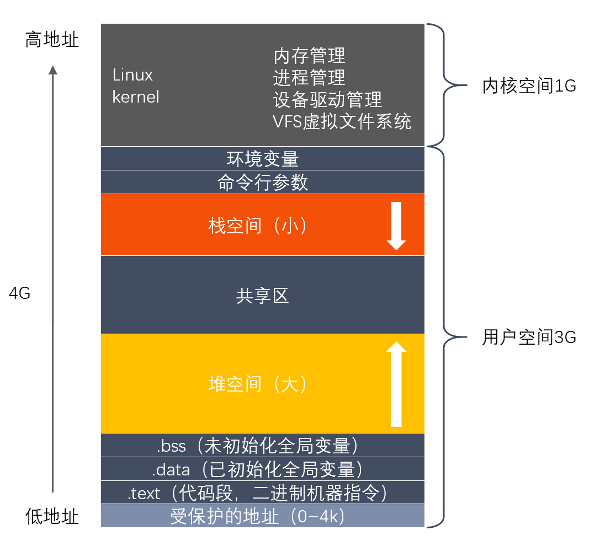

- [面试](#面试)
  - [```struct```和```class```的区别](#struct和class的区别)
  - [```include```中```<>```和```""```的区别](#include中和的区别)
  - [导入C函数的关键字是什么，C++编译时和C有什么不同？](#导入c函数的关键字是什么c编译时和c有什么不同)
  - [程序从源码到执行文件，预编译、编译、汇编、链接](#程序从源码到执行文件预编译编译汇编链接)
  - [```static```关键字](#static关键字)
  - [函数指针](#函数指针)
  - [静态变量初始化](#静态变量初始化)
  - [nullptr调用成员函数可以吗？为什么？](#nullptr调用成员函数可以吗为什么)
  - [野指针](#野指针)
  - [静态局部变量，全局变量，局部变量的特点，以及使用场景](#静态局部变量全局变量局部变量的特点以及使用场景)
  - [说说内联函数和宏函数的区别](#说说内联函数和宏函数的区别)
  - [运算符i++和++i的区别](#运算符i和i的区别)
  - [new和malloc的区别](#new和malloc的区别)
    - [malloc底层实现](#malloc底层实现)
    - [new底层实现](#new底层实现)
  - [const和define的区别](#const和define的区别)
  - [C++中函数指针和指针函数](#c中函数指针和指针函数)
  - [堆和栈的区别](#堆和栈的区别)
  - [C++的内存管理](#c的内存管理)
    - [内存分配方式---栈、堆、自由存储区、全局/静态存储区、常量存储区](#内存分配方式---栈堆自由存储区全局静态存储区常量存储区)
    - [常见的内存错误及其对策](#常见的内存错误及其对策)
    - [内存泄漏](#内存泄漏)
    - [malloc和局部变量分配在堆还是栈？](#malloc和局部变量分配在堆还是栈)
    - [进程的内存片段](#进程的内存片段)
  - [什么是内存对齐](#什么是内存对齐)
  - [面向对象的三大特征 封装、继承、多态](#面向对象的三大特征-封装继承多态)
  - [面向过程和面向对象的区别](#面向过程和面向对象的区别)
  - [重载和重写](#重载和重写)
  - [构造函数，默认构造函数、初始化构造函数、拷贝构造函数、移动构造函数。](#构造函数默认构造函数初始化构造函数拷贝构造函数移动构造函数)
  - [空类的默认生成函数](#空类的默认生成函数)
  - [C++ 类对象的初始化顺序，有多重继承情况下的顺序](#c-类对象的初始化顺序有多重继承情况下的顺序)
  - [深拷贝和浅拷贝](#深拷贝和浅拷贝)
  - [C++多态](#c多态)
  - [虚析构，为什么不能虚构造](#虚析构为什么不能虚构造)
  - [模板类是在什么时候实现的](#模板类是在什么时候实现的)
# 面试
## ```struct```和```class```的区别
- struct 一般用于描述一个数据结构集合，而 class 是对一个对象数据的封装；
- struct 中默认的访问控制权限是 public 的，而 class 中默认的访问控制权限是 private 的。
- 在继承关系中，struct 默认是公有继承，而 class 是私有继承；
- class 关键字可以用于定义模板参数，就像 typename，而 struct 不能用于定义模板参数。
  
| |C|C++|
|:---:|:---:|:---:|
|成员函数|不能有|可以|
|静态成员|不能有|可以|
|访问控制|默认public，不能修改|public/private/protected|
|继承关系|不可以继承|可从类或其他结构体继承|
|初始化|不能直接初始化数据成员|可以|
|使用方式|需要加上struct关键字|可以省略|
## ```include```中```<>```和```""```的区别
- 尖括号```<>```的头文件是系统文件，双引号```""```的头文件是自定义文件
- 编译器预处理阶段查找头文件的路径不一样。
  - 使用尖括号```<>```的头文件的查找路径：编译器设置的头文件路径-->系统变量。
  - 使用双引号```""```的头文件的查找路径：当前头文件目录-->编译器设置的头文件路径-->系统变量。
## 导入C函数的关键字是什么，C++编译时和C有什么不同？
- ```extern "C" int strcmp(const char *s1, const char *s2); //指示这部分代码按C语言进行编译```
- 编译区别：由于C++支持函数重载，因此编译器编译函数的过程中会将函数的参数类型也加到编译后的代码中，而不仅仅是函数名；而C语言并不支持函数重载，因此编译C语言代码的函数时不会带上函数的参数类型，一般只包括函数名。

## 程序从源码到执行文件，预编译、编译、汇编、链接
- 预编译
  - ```#define```宏定义替换
  - 处理条件预编译指令，```#if #ifdef```
  - 处理#include预编译指令，将被包含的文件插入到该预编译指令的位置。
  - 过滤所有的注释
  - 添加行号和文件名标识
- 编译
  - 词法分析 语法分析 语义分析
  - 代码优化 目标代码生成 目标代码优化
- 汇编
  - 将汇编代码转变成机器可以执行的指令
- 链接
  - 静态链接
    - 接的时候就已经把要调用的函数或者过程链接到了生成的可执行文件中
    - 删除静态库不影响程序执行。静态库:win:.lib文件，linux:.a文件
  - 动态链接
    - 执行的过程中，再去找要链接的函数，生成的可执行文件中没有函数代码
    - 删除动态库程序不可运行。动态库:win:.dll文件，linux:.so文件
## ```static```关键字
- 定义全局静态变量和局部静态变量
  - 在变量前面加上static关键字。初始化的静态变量会在数据段分配内存，未初始化的静态变量会在BSS段分配内存。直到程序结束，静态变量始终会维持前值。只不过全局静态变量和局部静态变量的作用域不一样；
- 定义静态函数
  - 在函数返回类型前加上static关键字，函数即被定义为静态函数。静态函数只能在本源文件中使用；
- 在c++中，static关键字可以用于定义类中的静态成员变量
  - 使用静态数据成员，它既可以被当成全局变量那样去存储，但又被隐藏在类的内部。类中的static静态数据成员拥有一块单独的存储区，而不管创建了多少个该类的对象。所有这些对象的静态数据成员都共享这一块静态存储空间。
- 在c++中，static关键字可以用于定义类中的静态成员函数
  - 与静态成员变量类似，类里面同样可以定义静态成员函数。只需要在函数前加上关键字static即可。如静态成员函数也是类的一部分，而不是对象的一部分。所有这些对象的静态数据成员都共享这一块静态存储空间。
- 静态成员函数
  - **因为静态成员函数不属于任何一个对象，所以不具备this指针，也就无法对一个对象中的非静态成员进行访问。**
## 函数指针
- 函数指针就是指向函数的指针变量。每一个函数都有一个入口地址，该入口地址就是函数指针所指向的地址。
- 应用场景：回调（callback）
  - 调用别人提供的 API函数，称为Call；
  - 如果别人的库里面调用我们的函数，就叫Callback；
  - 例如```sort()```函数自定义比较规则；
## 静态变量初始化
- C语言
  - 全局和静态变量，初始化发生在任何代码执行之前，属于编译期初始化。
- C++
  - 全局或静态对象当且仅当对象首次用到时才进行构造。
- 所在空间:都在静态存储区。
- 生命周期:静态全局变量、静态局部变量都在静态存储区，直到程序结束才会回收内存。类静态成员变量在静态存储区，当超出类作用域时回收内存
## nullptr调用成员函数可以吗？为什么？
- 可以
- 因为在编译时对象就绑定了函数地址，和指针空不空没关系。
- ptr为该类型的指针，在成员函数中的```this=ptr```,成员函数中使用到this，会导致运行出错。
## 野指针
- 指针指向的内存已经释放，指针未及时置空。此时指针的指向位置是不可知的，可能出现非法访问的错误。
- 避免方法
  - 初始化时置空->申请内存后判空->指针释放后置为nullptr
  - 使用智能指针
## 静态局部变量，全局变量，局部变量的特点，以及使用场景
- C++里作用域可分为6种：全局，局部，类，语句，命名空间和文件作用域。
  - 全局变量：全局作用域，可以通过extern作用于其他非定义的源文件。
  - 静态全局变量 ：全局作用域+文件作用域，所以无法在其他文件中使用。
  - 局部变量：局部作用域，比如函数的参数，函数内的局部变量等等。
  - 静态局部变量 ：局部作用域，只被初始化一次，直到程序结束。
- 所在空间：除了局部变量在栈上外，其他都在静态存储区。
- 生命周期： 局部变量在栈上，出了作用域就回收内存；而全局变量、静态全局变量、静态局部变量都在静态存储区，直到程序结束才会回收内存。
## 说说内联函数和宏函数的区别
- 宏定义不是函数
- 宏函数在预编译时把宏名用宏体进行替换，没有类型检查，无论对错都直接替换。
- 内联函数则是在编译的时候进行代码插入，编译器会在每处调用内联函数的地方直接把内联函数的内容展开，这样可以省去函数的调用的开销，提高效率。在编译的时候会进行类型的检查。
- inline一般应用于比较小的频繁调用的函数，函数前使用```inline```关键字定义。
  - 如果函数体内的代码比较长，使用内联将导致内存消耗代价较高。
  - 如果函数体内出现循环，那么执行函数体内代码的时间要比函数调用的开销大。
## 运算符i++和++i的区别
- 赋值顺序不同：++ i 是先加后赋值；i ++ 是先赋值后加；++i和i++都是分两步完成的
- 效率不同：后置++执行速度比前置的慢
- i++ 不能作为左值，而++i 可以
- 两者都不是原子操作
## new和malloc的区别
- new是操作符，而malloc是函数。
- new在调用的时候先分配内存，再调用构造函数，释放的时候调用析构函数；而malloc没有构造函数和析构函数。
- malloc需要给定申请内存的大小，返回的指针需要强转；new会调用构造函数，不用指定内存的大小，返回指针不用强转。
- new可以被重载；malloc不行。
- new分配内存更直接和安全。
- new发生错误抛出异常，malloc返回null。
### malloc底层实现
- 当开辟的空间小于 128K 时，调用 brk（）函数；当开辟的空间大于 128K 时，调用mmap（）。malloc采用的是内存池的管理方式，以减少内存碎片。先申请大块内存作为堆区，然后将堆区分为多个内存块。
### new底层实现
- 创建一个新的对象
- 将构造函数的作用域赋值给这个新的对象（因此this指向了这个新的对象）
- 执行构造函数中的代码（为这个新对象添加属性）
- 返回新对象
## const和define的区别
- const生效于编译的阶段；define生效于预处理阶段。
- const定义的常量，在C语言中是存储在内存中、需要额外的内存空间的；define定义的常量，运行时是直接的操作数，并不会存放在内存中。
- const定义的常量是带类型的；define定义的常量不带类型。因此define定义的常量不利于类型检查。
## C++中函数指针和指针函数
- 指针函数本质是一个函数，其返回值为指针。 函数指针本质是一个指针，其指向一个函数。
- 写法不同
  ```C++
  int *fun(int x,int y); //指针函数
  int (*fun)(int x,int y); //函数指针
  ```
## 堆和栈的区别
- 堆栈空间分配不同。栈由操作系统自动分配释放 ，存放函数的参数值，局部变量的值等；堆一般由程序员分配释放。
- 堆栈缓存方式不同。栈使用的是一级缓存， 它们通常都是被调用时处于存储空间中，调用完毕立即释放；堆则是存放在二级缓存中，速度要慢些。
- 堆栈数据结构不同。堆类似数组结构；栈类似栈结构，先进后出。
## C++的内存管理
- 在C++中，内存分成5个区，他们分别是堆、栈、自由存储区、全局/静态存储区和常量存储区。
### 内存分配方式---栈、堆、自由存储区、全局/静态存储区、常量存储区
- 栈，在执行函数时，函数内局部变量的存储单元都可以在栈上创建，函数执行结束时这些存储单元自动被释放。
- 堆，就是那些由new分配的内存块，一般一个new就要对应一个delete。
- 自由存储区，就是那些由malloc等分配的内存块，和堆是十分相似的，不过是用free来结束自己的生命。
- 全局/静态存储区，全局变量和静态变量被分配到同一块内存中。
- 常量存储区，这是一块比较特殊的存储区，里面存放的是常量，不允许修改。
### 常见的内存错误及其对策
- 错误
  - 内存分配未成功，却使用了它。
  - 内存分配虽然成功，但是尚未初始化就引用它。
  - 内存分配成功并且已经初始化，但操作越过了内存的边界。
  - 忘记了释放内存，造成内存泄露。
  - 释放了内存却继续使用它。
- 对策
  - 定义指针时，先初始化为nullptr。
  - malloc或new申请内存之后，应该立即检查指针值是否为nullptr。防止使用指针值为nullptr的内存。
  - 不要忘记为数组和动态内存赋初值。防止将未被初始化的内存作为右值使用。
  - 避免数字或指针的下标越界，特别要当心发生“多1”或者“少1”操作。
  - 动态内存的申请与释放必须配对，防止内存泄漏。
  - 用free或delete释放了内存之后，立即将指针设置为NULL，防止“野指针”。
  - 使用智能指针。
### 内存泄漏
- 什么是内存泄漏
  - new和malloc申请资源使用后，没有用delete和free释放；
  - 子类继承父类时，父类析构函数不是虚函数。
  - Windows句柄资源使用后没有释放。
- 怎么检测？
  - 良好的编码习惯，使用了内存分配的函数，一旦使用完毕,要记得使用其相应的函数释放掉。
  - 将分配的内存的指针以链表的形式自行管理，使用完毕之后从链表中删除，程序结束时可检查改链表。
  - 使用智能指针。
  - 一些常见的工具插件，如ccmalloc、Dmalloc、Leaky、Valgrind等等。
### malloc和局部变量分配在堆还是栈？
- malloc是在堆上分配内存，需要程序员自己回收内存；局部变量是在栈中分配内存，超过作用域就自动回收。
### 进程的内存片段

- 从低地址到高地址，由代码段、数据段、BSS段、堆、共享区、栈等组成。
- 数据段：存放程序中已初始化的全局变量和静态变量的一块内存区域。
- 代码段：存放程序执行代码的一块内存区域。只读，代码段的头部还会包含一些只读的常数变量。
- BSS 段：存放程序中未初始化的全局变量和静态变量的一块内存区域。
- 运行时，多出堆区和栈区
  - 堆区：动态申请内存用。堆从低地址向高地址增长。
  - 栈区：存储局部变量、函数参数值。栈从高地址向低地址增长。是一块连续的空间。
- 最后还有一个共享区，位于堆和栈之间。
## 什么是内存对齐
- 应用于三种数据类型中：struct/class/union，内存对齐原则有四个
  - 数据成员对齐规则：结构(struct)或联合(union)的数据成员，第一个数据成员放在offset为0的地方，以后每个数据成员存储的起始位置要从该成员大小或者成员的子成员大小的整数倍开始。
  - 结构体作为成员:如果一个结构里有某些结构体成员,则结构体成员要从其内部"最宽基本类型成员"的整数倍地址开始存储。(struct a里存有struct b,b里有char,int ,double等元素,那b应该从8的整数倍开始存储)。
  - 收尾工作:结构体的总大小，也就是sizeof的结果，必须是其内部最大成员的"最宽基本类型成员"的整数倍。不足的要补齐。(基本类型不包括struct/class/uinon)。
  - sizeof(union)，以结构里面size最大元素为union的size，因为在某一时刻，union只有一个成员真正存储于该地址。
## 面向对象的三大特征 封装、继承、多态
- 封装：将数据和操作数据的方法进行有机结合，隐藏对象的属性和实现细节，仅对外公开接口来和对象进行交互。
- 继承：可以使用现有类的所有功能，并在无需重新编写原来的类的情况下对这些功能进行扩展。
- 继承：可以使用现有类的所有功能，并在无需重新编写原来的类的情况下对这些功能进行扩展。
- 多态：用父类型别的指针指向其子类的实例，然后通过父类的指针调用实际子类的成员函数。实现多态，有二种方式，重写，重载。
## 面向过程和面向对象的区别
- 面向过程：根据业务逻辑从上到下写代码
- 面向对象：将数据与函数绑定到一起，进行封装，这样能够更快速的开发程序，减少了重复代码的重写过程
## 重载和重写
- 重写：是指派生类中存在重新定义的函数。其函数名，参数列表，返回值类型，所有都必须同基类中被重写的函数一致。只有函数体不同（花括号内），派生类对象调用时会调用派生类的重写函数，不会调用被重写函数。重写的基类中被重写的函数必须有virtual修饰。
- 重载：是指同一可访问区内被声明的几个具有不同参数列（参数的类型，个数，顺序不同）的同名函数，根据参数列表确定调用哪个函数，重载不关心函数返回类型。
## 构造函数，默认构造函数、初始化构造函数、拷贝构造函数、移动构造函数。
- 默认构造函数和初始化构造函数。 在定义类的对象的时候，完成对象的初始化工作。有了有参的构造了，编译器就不提供默认的构造函数。
- 赋值构造函数默认实现的是值拷贝（浅拷贝）。
- 移动构造函数。用于将其他类型的变量，隐式转换为本类对象。
## 空类的默认生成函数
- 无参的构造函数 在定义类的对象的时候，完成对象的初始化工作。
- 拷贝构造函数 拷贝构造函数用于复制本类的对象
- 赋值运算符 ```Empty& operator = (const Empty& copy)```
- 析构函数（非虚）
## C++ 类对象的初始化顺序，有多重继承情况下的顺序
- 创建派生类的对象，基类的构造函数优先被调用（也优先于派生类里的成员类）；
- 如果类里面有成员类，成员类的构造函数优先被调用；(也优先于该类本身的构造函数）
- 基类构造函数如果有多个基类，则构造函数的调用顺序是某类在类派生表中出现的顺序而不是它们在成员初始化表中的顺序；
- 成员类对象构造函数如果有多个成员类对象，则构造函数的调用顺序是对象在类中被声明的顺序而不是它们出现在成员初始化表中的顺序；
- 派生类构造函数，作为一般规则派生类构造函数应该不能直接向一个基类数据成员赋值而是把值传递给适当的基类构造函数,否则两个类的实现变成紧耦合的（tightly coupled）将更加难于正确地修改或扩展基类的实现。（基类设计者的责任是提供一组适当的基类构造函数）
- 父类构造函数–>成员类对象构造函数–>自身构造函数，其中成员变量的初始化与声明顺序有关，构造函数的调用顺序是类派生列表中的顺序，析构顺序和构造顺序相反。
## 深拷贝和浅拷贝
- 浅拷贝：又称值拷贝，将源对象的值拷贝到目标对象中去，本质上来说源对象和目标对象共用一份实体，只是所引用的变量名不同，地址其实还是相同的。
- 深拷贝：拷贝的时候先开辟出和源对象大小一样的空间，然后将源对象里的内容拷贝到目标对象中去，这样两个指针就指向了不同的内存位置。
- 深拷贝的实现：深拷贝的拷贝构造函数和赋值运算符的重载传统实现
## C++多态
- 由于派生类重写基类方法，然后用基类引用指向派生类对象，调用方法时候会进行动态绑定，这就是多态。 多态分为静态多态和动态多态
- 静态多态：编译器在编译期间完成的，编译器会根据实参类型来推断该调用哪个函数，如果有对应的函数，就调用，没有则在编译时报错。
- 动态多态：其实要实现动态多态，需要几个条件——即动态绑定条件
  - 虚函数。基类中必须有虚函数，在派生类中必须重写虚函数。
  - 通过基类类型的指针或引用来调用虚函数。
## 虚析构，为什么不能虚构造
- 虚析构：将可能会被继承的父类的析构函数设置为虚函数，可以保证当我们new一个子类，然后使用基类指针指向该子类对象，释放基类指针时可以释放掉子类的空间，防止内存泄漏。如果基类的析构函数不是虚函数，在特定情况下会导致派生来无法被析构。
  - 用派生类类型指针绑定派生类实例，析构的时候，不管基类析构函数是不是虚函数，都会正常析构
  - 用基类类型指针绑定派生类实例，析构的时候，如果基类析构函数不是虚函数，则只会析构基类，不会析构派生类对象，从而造成内存泄漏。为什么会出现这种现象呢，个人认为析构的时候如果没有虚函数的动态绑定功能，就只根据指针的类型来进行的，而不是根据指针绑定的对象来进行，所以只是调用了基类的析构函数；如果基类的析构函数是虚函数，则析构的时候就要根据指针绑定的对象来调用对应的析构函数了。
- 不能虚构造的原因
  - 从存储空间角度：虚函数对应一个vtale,这个表的地址是存储在对象的内存空间的。如果将构造函数设置为虚函数，就需要到vtable 中调用，可是对象还没有实例化，没有内存空间分配，如何调用。
  - 从使用角度：虚函数主要用于在信息不全的情况下，能使重载的函数得到对应的调用。构造函数本身就是要初始化实例，那使用虚函数也没有实际意义呀。所以构造函数没有必要是虚函数。虚函数的作用在于通过父类的指针或者引用来调用它的时候能够变成调用子类的那个成员函数。而构造函数是在创建对象时自动调用的，不可能通过父类的指针或者引用去调用，因此也就规定构造函数不能是虚函数。
  - 从实现上看，vbtl 在构造函数调用后才建立，因而构造函数不可能成为虚函数。从实际含义上看，在调用构造函数时还不能确定对象的真实类型（因为子类会调父类的构造函数）；而且构造函数的作用是提供初始化，在对象生命期只执行一次，不是对象的动态行为，也没有太大的必要成为虚函数。
## 模板类是在什么时候实现的
- 模板实例化：模板的实例化分为显示实例化和隐式实例化，前者是研发人员明确的告诉模板应该使用什么样的类型去生成具体的类或函数，后者是在编译的过程中由编译器来决定使用什么类型来实例化一个模板不管是显示实例化或隐式实例化，最终生成的类或函数完全是按照模板的定义来实现的
- 模板具体化：当模板使用某种类型类型实例化后生成的类或函数不能满足需要时，可以考虑对模板进行具体化。具体化时可以修改原模板的定义，当使用该类型时，按照具体化后的定义实现，具体化相当于对某种类型进行特殊处理。